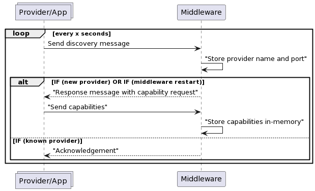

# Service discovery of providers and apps

- Status: superseded by [adr-0012](./0012-intent-registration.md)
- Authors: Bastian Burger, Spyros Giannakakis, Daniel Heinze, Daniele Antonio
  Maggio, Maggie Salak
- Last updated: 2022-06-08

## Problem Statement

The AUTOSAR XML (.arxml) declaration contains all capabilities and providers of
the car. During system runtime we don't know where (ip:port) these capabilities
are offered. What is more, due to components potentially restarting this
information might change dynamically. This is the problem addressed in this ADR.

### Sub-problems

The overall problem statement can be broken down further into:

- [Network discovery of the providers](#considered-options-for-provider-discovery)
- [Network discovery of the middleware](#considered-options-for-middleware-discovery)
- [Network discovery of apps (vs providers)](#app-discovery-vs-provider-discovery)
- [Capability registrations of the providers/apps](#considered-options-for-capability-registration)
  - Knowing where to find the providers/apps is not enough as we need a way to
  know which capabilities they offer as well.
- [Registrations store](#registration-store)

## Context

The current plan regarding the architecture is depicted in the following
diagram

where:

- **Apps** are high-level applications written by 3rd party developers. They can
  use functionalities from providers and other apps.
- **Middleware** handles the communication between the components, does
  authentication/authorization etc.
- **Providers** offer (not consume) hardware services/capabilities as defined in
  the .arxml file. They run in their own containers.
  - **Connectors** understand the commonly agreed communication protocol (e.g.
    gRPC) and can "translate" to whatever protocol the component needs. In the
    case of the automotive industry underlying protocols can be SOME/IP, DDS,
    MQTT etc.

### In-scope

- Middleware discovery: the providers and apps also need to know where to find
  the middleware. Defining this statically in the twin or other configuration
  is not sufficient in the case of a middleware restart where the assigned IP
  might change.
- When a provider or app is present in the car it can keep generating
  data/values with high frequency (e.g. every second) or seldomly. We don't
  assume there is a constant flow of values for this ADR.

### Out of scope

- The control plane: at the moment of this writing we do not know what control
  plane would be available for us and what features it could have. The control
  plane development itself is also not a part of this stream.
- Capabilities and how they are registered/exposed: the exact semantics of how
  capabilities look like will be covered in another ADR. Here we cover mostly
  the flow and provide an examples of how registrations could look like.

### Constraints

- The environment we are operating (e.g. car ECU) has resource constraints
  especially when it comes to available memory and executable size.
- Both apps and providers are developed by 3rd parties.
  - As such they can not be trusted by default and all communication needs to
  pass through the middleware that would ensure Access Control Management.

### Assumptions

- We assume that we won't need discovery across networks/ECUs, at least initially.
- There won't be a provider ever offering the same capability as another one.
  - Even if that's a valid use-case, the capability registry could be used to load balance
  among the different service instances. -> SOME/IP Service Discovery accounts
  for load balancing and several server instances offering the same service
  interface.
- The middleware does not have access to the manifests of the
  applications/providers before the discovery
- Name resolution is resource-wise a feasible option for service discovery.

## Decision Drivers

Solution needs to

- Handle startup phase where containers come up in different order. The order in
  which the various containers might boot up is not defined
- Recover gracefully from restarts/shutdowns of components as this can happen at
  any moment.
- Be integrated as part of an SDK provided to third party developers (for
  ease-of-use)

## Considered options for provider discovery

- [Central capability registry service](#option-1-capability-registry-service) for providers with
  these sub-options:
  - [Self-registration with name resolution](#sub-option-i-self-registration-with-name-resolution)
  - [Self-registration without name resolution](#sub-option-ii-self-registration-without-name-resolution)
  - [*Registrar* component](#sub-option-iii-external-registrar-component)
- [Decentralised (P2P) service
  discovery](#option-2-decentralised-service-discovery)

## Considered options for middleware discovery

- With name resolution
- Without name resolution: multicast to a predefined address:port
- Without name resolution: unicast (acknowledgement) to the registered
  providers/apps

See [relevant section](#middleware-discovery) for analysis.

## Considered options for apps discovery

- Discovery mechanism same as providers
- Different mechanism

See [relevant section](#app-discovery-vs-provider-discovery) for analysis.

## Considered options for capability registration

- Push to middleware
- Pull from the middleware

See [relevant section](#capabilities-registration) for analysis.

## Considered options for registration store

- In-memory
- Persistent

See [relevant section](#registration-store) for analysis.

## Decisions

- The applications and providers are treated **similarly** in terms of service
  discovery.
  - We may choose at a later point to differentiate between the two.
  - For simplicity (same flow), we require even apps that don't provide any capability to
    register.
- The chosen option is to utilize a [**central capability
  registry**](#option-1-capability-registry-service) instead of a decentralized
  approach and more specifically use
  [**self-registration with name resolution**](#sub-option-i-self-registration-with-name-resolution).
  - As a concequence of the name resolution choice, we don't need middleware
    discovery.
- We do not want to rely on maintaining an open socket between the middleware
  and the providers/apps for the discovery.
  - To recover from middleware restarts, we are sending the discovery message
    periodically. This is simpler to do instead of reacting to the socket being
    down.
  - We consider a stretch to purge registrations if we don't receive a heartbeat
  for a specific time.
  - For events/streaming values (which happen after the discovery phase-out of
    scope for this ADR) we can still choose to use an always-on socket.
- Due to the decision to send the discovery message periodically, we want to
  send capabilities **separately** and specifically using a **push** model to
  the middleware due to the minimum implementation overhead that poses for the
  3rd party developers.
- Due to the added complexity that a persistent storage would bring with minimum
  value-added (we still could get out of sync providers), we decide to use
  an **in-memory store**, stateless storage for the registrations.

The overall flow is summarised below

## Pros and Cons of different options - analysis

### Option 1: Capability registry service

A central capability registry service running as part of the middleware that handles
registrations of providers and apps and stores them. The [registration
store](#registration-store) could be an additional component or bundled within
the registry.

### Sub-option i: Self-registration with name resolution

With name resolution in place we do not need network discovery (ip:port) but we
do need a "routable" name for the provider/application because this is dynamic
information not known in middleware deployment time (e.g. over-the-air update).

- The middleware gets a predefined name (part of the configuration)
- Providers boot up and join the predefined (bridge) network.
- Providers contact the middleware container using the predefined
  name.
  - This message could be bundled with the capabilities flow for less network
    traffic or the capability registration flow would need to be initiated.

In the case of the middleware restarting, we have the following options:

- Persist registrations of providers and hydrate the middleware state from this
  store.
  - Problematic as this can get out of sync/complex to handle.
- Multicast message on middleware startup to the providers to re-announce
  themselves.
- The provider can continue sending periodically its name to the middleware to ensure the
  state is hydrated properly.
  - This solves also the case where the middleware starts out-of-order (after
    the provider)
- If we are able to use a socket, the providers could identify that the
  middleware is down and re-initiate the discovery.

### Sub-option ii: Self-registration without name resolution

The flow would look like this

- The middleware binds to a predefined, multicast ip:port (part of the configuration).
- Providers boot up and join the predefined (bridge) network.
- Providers announce themselves on the multicast address with their name, ip and
port.
- The middleware receives the announcement and triggers the capability
  registration flow - see [Capabilities registration](#capabilities-registration).

An example of `announcement` message might be: `traffic-network:172.17.0.2:5678`
where `traffic-network` is the name of the provider/application followed by the
IP and the port on which the connector is being exposed.

As soon as an application/provider is starting up, it starts sending the
announcement message and keeps sending it with a frequency to be decided later
on.

The repeated transmission is both useful as a liveliness check, delayed startup
of middleware and also helps in case of a component restart
(app/provider/middleware).

In case of graceful shutdowns, an application/provider should send a final
message to de-register itself from the registry.

As an alternative to the repeated transmission, if we are able to use a socket
we can monitor its status to re-initiate discovery.

#### Advantages

- Low implementation overhead
- Relatively lightweight in terms of needed crates and dependencies
- It is applicable regardless of the control plane that manages the execution of
the containers

#### Disadvantages

- Requires implementation to be done on both middleware and application or
  providers side
- Some constant network traffic has to be expected for the multicast messages

### Sub-option iii: External registrar component

The previous discovery pattern relies on well-behaved providers that keep the
connection open or send periodic heartbeat messages to the registry. Given that
the providers are offered by other parties, a "passive" discovery pattern might
be more under our control:

- A provider boots up and joins a predefined network.
  - The provider exposes their capabilities in an defined endpoint.
- A *registrar* with access to the Docker daemon checks periodically the
  predefined network for containers that joined or asks the control plane.
  - The registrar can be the same component as the registry for simpler
  deployments. If it's a separate one due to different scaling needs, we need to
  ensure it is also highly available. For this discussion we will assume it is
  the registry/middleware.
- The registrar initiates the capability registration flow - see below.

For this option we need the following requirements to be fulfilled

- A way to discover available providers:
  - Via the control plane but we are not sure at the moment of this writing,
  which control plane would be available to us.
  - Via the Docker daemon, the registry could inspect a known Docker network for
    the containers connected to it.
- Providers should expose an endpoint to retrieve the capabilities they offer.

This solution handles components booting up in a different order: if the
middleware is available after some of the providers booted, it will detect which
containers have already joined the defined network. The same applies for
shutdowns/restarts (graceful or not): by polling periodically the middleware
will become aware of changes in the Docker network. If the middleware itself
restarts, the state will be hydrated again from the state of the Docker network.

#### Advantages

- Relies *less* on well-behaved providers that we don't control
  - Debatable since providers would still need to expose an endpoint with the
    capabilities they provide, but don't need to actively register or send a
    heartbeat message.
- Less network traffic required at least between the registrar/middleware and
  the providers.
- In [the self-registration approach](#sub-option-ii-self-registration-without-name-resolution) all other
  providers/apps can listen to registrations as well, meaning that they could
  potentially try to access other providers directly and not via the middleware.
  - This can be mitigated by having TLS on the connection from middleware to the
    provider.

#### Disadvantages

- Relies either on the control plane which is not decided what it will be or on
  having root access (for the Docker daemon). The latter could pose a security
  or compliance risk.
- Does not conform to the SOME/IP discovery mode (uses multicast) which might be
  expected/known already from automotive stakeholders or developers in the industry.
- Requires a specific crate for Docker operations that would otherwise not be needed from
  the middleware/adds overhead.

### Option 2: Decentralised service discovery

In this mode, providers and apps would announce themselves and other
providers/apps would become aware of them and note their IP and port. Besides
the complexity that approach would bring due to the [CAP
theorem](https://en.wikipedia.org/wiki/CAP_theorem) (e.g. a network partition
can make some providers "discover" only a subset of the available providers),
ACL would also be difficult to enforce since the communication happens directly
between providers/apps and not through a middleware.

We decide to not explore further this approach at least for now.

### Discovery message format

The format of the discovery message should include the following

| Field | Purpose |
|---|---|
| Routable identifier | Identifier that the middleware can use to reach the provider, can be IP or container name if name resolution is in place |
| Port | Port that provider listens to for function invocations from the middleware  |
| Version | Versioning for the provider that can reflect semantic versioning changes on the capabilities it offers |

## Middleware discovery

In the case where we don't have name resolution in place, the middleware can
announce its IP/Port to any provider/application that needs to access it. Two
options are considered here:

- The middleware is behaving exactly as any other application/provider and
  frequently multicasting its IP/Address.
- The middleware is sending its `announcement` message when a new registration
  is received directly to the provider/app being registered (unicast)

### Advantages of unicast

- A unicast to registered providers/apps can act as an acknowledgment of
  registration (only registered components will get it).
- We can enforce TLS on unicast.
- The channel established can be utilised for the future communication between
  the provider/app and the middleware.

### Disadvantages of unicast

- Additional network traffic: the middleware would need to send multiple
  (unicast) messages to every app and provider registered

## App discovery vs provider discovery

The same patterns as for the providers are also applicable here:
self-registration (with or without name resolution) or external registrar.

There are some differences though between providers and apps. The providers
specifically are exposing car specific services/interfaces. There won't be a
provider ever offering the same capability as another one. With Apps, we can
think more along the lines of capabilities and multiple apps could offer the
same capability. Secondly, we can consider applications to be more feature-rich
than providers.

Another difference between providers and apps is that there are applications
that are only consumers of capabilities and not providing any.

### Advantages of having the same mechanism for apps and providers

- Simpler to deploy
- Code re-use
- A single approach is easier to learn and reason about also for external
  developers

### Disadvantages

- Separation of concerns: we would tie up together registration of components
  (providers/apps) with potentially different stability or/and scaling needs

## Capabilities registration

On the pull model: the middleware asks what capabilities does the provider/app
offer. There are two variants here: the middleware asks the provider/app for
their capabilities or it gets them from the control plane after an
application/provider installation to the middleware. Since we do not have
information on the control plane, we do not evaluate further this variant at the
moment.

On the push model, those are pushed from the provider/app to the
middleware. This can happen via a SDK call that handles the backoff/retry
strategy to the middleware.

In both of these modes, we potentially want to split the discovery message from the
capabilities message: the capabilities would be more static throughout the lifetime of
a provider/app and would also be larger so we should not send it with the same
frequency as the discovery.

What is more, in both of these modes we need to have some common format of the
capabilities that is understood by both parties but this is out of scope of this ADR.

Advantages of push

- Less overhead for the third party developers as they would otherwise need to
  expose an endpoint with their capabilities additionally instead of only
  calling the SDK.

Disadvantages

- Less control over when/how often to ask for the capabilities in order not to
  saturate the network bandwidth/do better load balancing.
- More implementation effort for the middleware.

### Capability registration message format

The capability message should include at least the following

| Field | Purpose |
|---|---|
| Capability identifier | Identifier for the capability |
| Version | Semantic versioning that is used in the provider evaluation from the middleware |
| Events | Value updates that can be subscribed to from apps |
| Functions | Functions that can be invoked from the apps |
| Priority | Priority evaluation from the middleware |
| QoS Policy | Policy evaluation from the middleware |

For `Priority`, [see priorities
section](0003-capability-oriented-services.md#priorities) in Capability-oriented
services ADR while for `QoS Policy`, refer to [QoS policies
section](0003-capability-oriented-services.md#qos-policies).

## Registration store

The registration store could be in-memory or persistent:

- a persistent one could be used to hydrate the state in case the middleware
goes down but would increase memory usage (HDD) which could be a prohibiting
factor. Also this store could get out-of-sync easily.
- an in-memory only store, which could be hydrated from a heartbeat message
sent from the providers/apps periodically

Note: This store should be differentiated from the "V-store" that stores the
vehicle state.

## Additional notes

### App SDK

No matter if a persistent or in-memory registration store is used, there is no
guarantee that the provider/app is still available at the time so
backoffs/retries would still be required from the apps. This resiliency should
be part of the compiled SDK.

The SDK should also include the interface/capabilities needed from the apps as
direct calls (e.g. `car.window.lower()`) but would not have knowledge on where
to find the provider that offers this interface/capability: this would be the
responsibility of the mw to route requests correctly.
