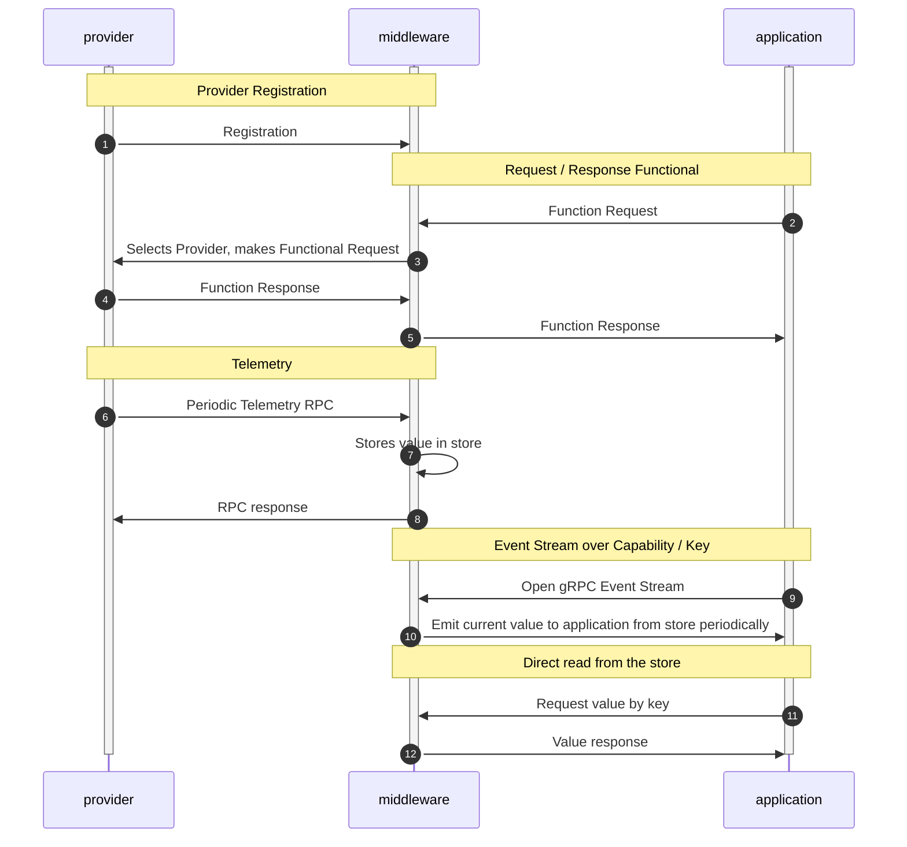

# Component Communication and Serialization

- Status: deprecated (not applicable to Chariott)
- Authors: Tim Park, Patrick Schuler
- Date: 2022-04-21

## Context and Problem Statement

We have three components in the SDV programming model hosted in different
containers:

- Applications
- Middleware
- Providers

The communication between these components will be standardized with a common
implementation and re-used across all components.

## Requirements

1. Efficiency is key to maximize reach to the least capable hardware platforms:
   1. Memory footprint is low
   1. Memory allocations are kept to a minimum
   1. CPU time is minimized
1. We want an abstract and stable interface for the middleware that ideally does
   not know the schema for function calls or data values that are utilized by
   the system.
1. Both the Application SDK and the Provider SDK need to be able to translate to
   the full schema defined by ARXML for their particular method/event.
1. We support both event based and request/response functional models.
1. The underlying application layer protocol is abstracted so we can switch to a
   different implementation if required.

## Considered Options

1. gRPC and protobuf implemented using [tonic][tonic].
1. Direct and fixed serialization mechanism

## Decision Outcome

We will go with gRPC for the first version. It provides a very good baseline
performance. We do not have solid minimum requirements regarding the baseline,
hence the assumption right now is that it is good enough.

### Positive Consequences

- Reusing industry defacto standard in gRPC with proven and tested code
- Simple implementation using [tonic][tonic] in Rust
- Efficient - as seen based on the results of a Spike that we conducted

### Negative Consequences

- Less flexible should we require more speed/less overhead or more complex
  serialization logic
- There is a small overhead coming with the [tonic][tonic] library - see the
  spike

## Links

- [tonic][tonic]

[tonic]: https://github.com/hyperium/tonic "tonic"

## Design Option 1

The communication between provider and applications has to be aware of the
schema that is exposed in the car through lower level services. A generation
tool (separately proposed) will translate between the industry specific ARXML to
the industry generic DTDL and then to a typed SDK that is utilized by both
providers and applications. The middleware however, does not need to know about
all the details of the function calls for example. This is opaque to the
middleware -- and it is the job of the SDKs to serialize/deserialize to/from the
correct schema -- allowing the middleware to remain generic over them. The
serialization specifics for how values are relayed in the system are encoded
under the covers in the SDK and are not exposed to the developer.

### Sequence Diagram

The proposed flow for how providers work with the middleware is shown above.

1. The provider registers with the middleware, telling it the capabilities it
   supports, which the middleware retains. [Service Discovery
   ADR](./0001-service-discovery.md)
2. The application sends a request to the middleware to call a particular
   interface
3. the middleware looks up the provider for the particular interface/capability
   and routes the request to the provider.
4. The middleware receives the response from the provider.
5. The response is relayed to the originating application.
6. A provider may also open a streaming gRPC interface with the middleware and
   relay telemetry values to the middleware.
7. The middleware stores these events in its store such that they are available
   for clients.
8. The middleware sends a response to the provider indicating success/failure of
   the update.
9. Clients subscribe to value changes through the middleware
10. When updates to values are received, the event subsystem validates the
   subscriptions and triggers events accordingly.
11. Clients can directly request values through the middleware by specifying the
    key.
12. Value response is sent back to the application including the current state

> Request / Response example: An application might request that the middleware
`set_desired_temperature` on a supporting `climate` provider to enable the user
to set a cabin temperature, and the provider would response with the current set
point for the climate system.

### Developer Experience Viability with this Approach

The conducted spike determined that a fairly ergonomic developer experience was
possible in this model. A concrete application prototype and provider prototype
are available in that previous work for examination. Further progress is
possible (once a model is settled on) to further simplify this with Rust macros
and other techniques.
