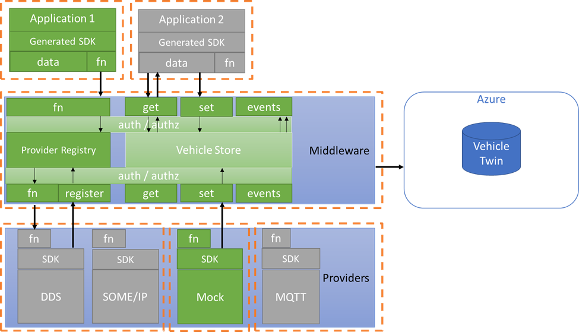

# Provider-Middleware interactions

- Status: deprecated (not applicable to Chariott)

## Context and Problem Statement

This ADR is defining the interactions between a capability provider and the
middleware.



### In scope

- Definition of an interface for sending a single value in the v-store
- Definition of an interface for sending multiple values in the v-store
- Definition of an interface for invoking remote procedures in a capability
  provider
  - The interface has to take into account the possibility for a capability
    provider to invoke ara:com C/C++ libraries

### Out of scope

- Definition of the v-store features and capabilities
  - This ADR is going to assume that the v-store is a key-value storage. In
    initial version, values can only be accessed by their key and there are no
    querying or indexing functionalities on the values expected.

## Sending data to the v-store

Capability providers will need to send some telemetry data in the v-store.
Update to fields in the v-store can be considered one of the main source of
events in the SDV programming model.

When storing data, being the v-store a key-value store, we need to clarify the
nature of the key and the values being stored.

As an example, let's assume there is a need to store the `MainUser` of the
system and let's think about the following structs

```rust
struct Address {
  city: String,
  country_code: u32
}

struct User {
  username: String,
  lives_in: Address
}
```

The key in the v-store is always represented by a couple of UTF8 strings
respectively representing `capability id` and `data id` (i.e.: `MainUser` would
be the `capability id` and `username` would instead be the `data id`).

The only allowed value type is a byte array.

The middleware is not aware of the actual type of the content, which means that
value will be saved as they are received in the middleware. This could be a
limitation in future releases where querying/indexing capabilities might be
helpful.

Depending on the key-value implementation, an additional field, a metadata or a
prepended fixed-length byte array will help to identify the type of the field
being stored.

The middleware should expose the following operations:

- A `SET` operation, accepting a UTF8 encoded string representing the
  `capability id`, a UTF8 encoded string representing the `data id`, a optional
  `byte array` for the UTF8 encoded type name of the value being stored and a
  `byte array` representing the value itself as input parameters
- A `GET` operation, accepting two strings as input parameters (`capability id`
  and `data id`) and returning a `byte array`

We conducted an investigation on what is more performant between unary `SET`
requests or a streaming of multiple data. Given the `single instance nature` of
the middleware/v-store and the assumption of having high frequency events, it
has been noticed that gRPC streaming might be a good technology choice for
having higher performances when setting values in the v-store.

Given the simplicity of the SET interface, depending on the way the operation is
being called, the entries in the v-store will look like differently:

- The caller can serialize the entire struct as a byte array.<br/>
  This means there will only be a `MainUser` key with a byte array as a
  value<br/>
  The solution has the disadvantage of limiting the querying/indexing
  capabilities when, as an example, an application might require only the
  `country_code` property for the MainUser.<br/>
  In addition, if the provider had the ability to understand that only a portion
  of the `MainUser` struct updated, it would be forced to always send the entire
  `MainUser` serialization.
- As an alternative, the SDK being generated for the provider has the capability
  of serializing/deserializing the complex struct in a smarter way.<br/>
  The following key-values should be sent over the wire and written to the
  v-store as separate values:
  - (`MainUser`,`username`) - byte array
  - (`MainUser`,`lives_in.city`) - byte array
  - (`MainUser`,`lives_in.country_code`) - byte array<br/>
  This option should be preferred and has the advantage of providing a better
  querying/indexing capability if needed. The main disadvantage is the added
  complexity that is needed when generating the SDK.

When it comes to the GET operation, it should be possible to retrieve both leaf
nodes (i.e. MainUser.username) of the tree and eventually intermediate nodes
(i.e. MainUser). In the latter case of a intermediate node the middleware should
retrieve and serialize all its leaf nodes in such a way that the caller can
deserialize the transmitted bytes to a complex typed struct

### A possible optimization

When the frequency of the `SET` operations is quite high, it could be
*problematic* the verbosity brought by always needing to specify the entire key
of the value being saved.

Assuming we can have an always-on streaming channel between the two parties,
when the provider is connecting to the middleware for the first time, it can
request to agree on a shorter "identification number"-based representation of
the string keys that it is expected to send.

As an example, given the previous `MainUser` scenario, the provider and the
middleware can agree that there is a mapping between the following:

- `MainUser` - 0
- `username` - 1
- `lives_in.city` - 2
- `lives_in.country_code` - 3

In this way, the over-the-wire serialization for the single telemetry events to
be sent would have the need to only specify two integers instead of two string
key, which could take up to 30bytes in the case of the longest key in the
current example.

The optimization proposed here will not be part of the initial CTP
implementation, but is suggested for a future iteration.

## Invoking remote procedures in a capability provider

Capability providers expose functions that can be remotely invoked from other
applications.

Both `applications` and `providers` can expose procedures that can be remotely
invoked; in addition some specific `hardware abstraction layer providers` will
need to interact with C/C++ libraries, therefore the considered option should
take this into account.

The provider should expose a `INVOKE` interface:

- accepting as input parameters:
  - a `OPERATION` string, explicating which procedure needs to be invoked
  - a `ARGUMENT` byte array, being the serialization of the input parameter
    values of the remote procedure
- returning as output:
  - either a `OUTPUT` byte array, being the serialization of the output values
    of the remote procedure invocation
  - or a `ERROR` enum, encoding a possible condition error being returned when
    invoking the remote procedure

On the middleware side, the same `INVOKE` interface should be available, with
the addition of a input `CAPABILITY` string, only useful for routing to the
proper provider.

## Decisions

As a summary, the following decisions are made:

- A "smart" serialization, using a (`capability id`, `data id`) format, of
  complex structs has to be part of the code generated for the SDKs
- The keys and values are being sent/retrieved to/from the middleware as byte
  array, regardless of their type
- In case of high frequency data, the values have to be sent over gRPC streaming
  if applicable
- The generated SDK for providers needs to include all the structs involved in
  telemetry or method invocation. This includes both the properties and the
  custom implementation for serialization in byte array. The same structs need
  to be available and included in the SDK generated for any application
  receiving data or needing to invoke methods.
- The generated SDK for providers need to provide, when it comes to telemetry, a
  SET/GET interface which can **only** accept structs that are serializable as
  previously defined
- The generated SDK for providers need to provide, when it comes to method
  invocation, a implementation of the previously defined interface which is
  capable of:
  - matching the input `OPERATION` to one of the functions in the provider
  - deserializing the `ARGUMENT` byte array to the expected input parameter(s)
  - invoking the function
  - returning the output(s) as a serialized byte array (or the error enum)
