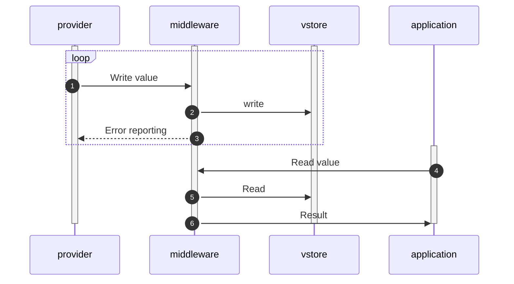

# Vehicle Store (V-Store)

- Status: deprecated (will be covered by project Ibeji)
- Authors: Patrick Schuler
- Date: 2022-05-06

## Context and Problem Statement

The middleware is acting as a central component to accumulate and distribute
telemetry data from the car. Providers connecting to the middleware are
publishing events to the vehicle-store service. The service will forward the
data to the vehicle-store, where the data is stored and kept up to date.

## Requirements

1. The vehicle store implementation and the service are not coupled.
1. We need to perform quick point reads on the data.
1. We need to be able to sync the data to the cloud.
1. Multiple providers need to be able to write multiple telemetry values
   quickly.

## Out of Scope

1. Events firing based on changes are out of scope and are part of the event
   subsystem ADR.
1. API defintion is part of [Provider-Middleware
   interactions][providermiddlewareapi]
1. The V-Store is a current representation of the car's state. It does not
   handle historical data.

## Considered Options

1. In-memory key value store
1. FASTER
1. Redis

## Decision Outcome

For CTP we target a simple in-memory key value store ([Option
1](#design-option-1)]). We do not need advanced query capabilities and assume
that the size of the store in first iterations can fit in memory. The store is
hosted in the same process as the middleware.

### Positive Consequences

- Simple solution with good performance
- Option to extend with other stores

### Negative Consequences

- If the middleware goes down, the store needs to be re-initialized - We believe
  that this is not a problem, as the data coming from the car will re-initialize
  the store very quickly. Without the providers being ready, the applications
  can't start working anyway.
- No advanced query capabilities - Things like notify me when the value of x is
  over a certain threshold won't be supported. FASTER for example is looking
  into adding indexing capabilities, that would allow that. We do not need this
  for the CTP.

## Links

## Design Option 1

A service facade that is exposed through the communication layer to both,
applications and providers is setup in the middleware. APIs to update/add and
read a single value are exposed. The APIs are kept simple and will only offer
single key/value read/write capabilities.

The information in the v-store is kept in a structure that allows quick lookups
through the key. The value is kept unchanged from what we received from the
providers to allow quick read and write operations.

Once we implement the described option in [Provider-Middleware interactions -
Optimization][providermiddlewareapi-optimization] we can add metadata
information for the keys and keep that in a separate store to utilize more
advanced deserialization scenarios (for example, to sync into the cloud).

[Provider-Middleware interactions][providermiddlewareapi] describes the details
on the expected interface to the middleware.

### Sequence Diagram

1. The provider starts writing values as they arrive from the car. The frequency
   is depending on the telemetry item that is received.
1. The middleware is forwarding the request to the v-store for storage.
1. The middleware is notifying the provider about failures.
1. An application requests a particular value from the middleware.
1. The middleware does check with the v-store for the value.
1. The result is serialized and provided to the application.

## Links

- [Provider-Middleware interactions][providermiddlewareapi]

[providermiddlewareapi]: ./0006-provider-middleware-interface.md "Provider API"
[providermiddlewareapi-optimization]: ./0006-provider-middleware-interface.md#a-possible-optimization "Provider API Optimization"
