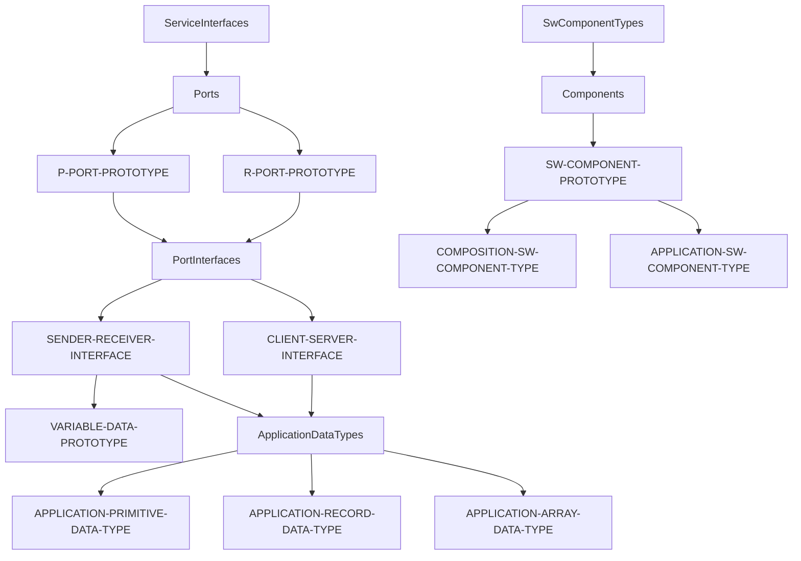
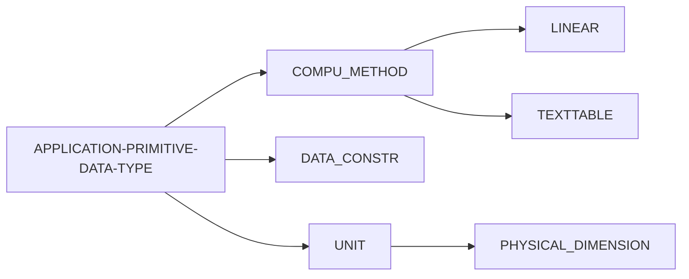
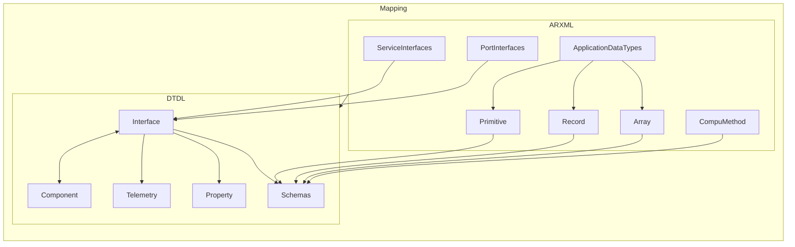

# ARXML to DTDL Mapping

- Status: deprecated (as out of scope for Chariott)
- Authors: Dariusz Parys
- Date: 2022-09-06

## Context and Problem Statement

DTDL is the base for SDV rust code generation. Therefore we need to translate
ARXML model definitions into DTDL version2 definitions.

## Mapping

The following sections describe the mapping between ARXML and DTDL for several
of the ARXML components. They are two approaches such a mapping resolution can
be done

- translate everything in the existing ARXML files to DTDL
- translate only SwComponentTypes including all resolved entities to DTDL

### ServiceInterfaces and Sub Elements

The entry point to the ARXML definition is the ServiceInterface
element in the ARXML file, the following flowchart shows the dependencies to
retrieve the complete modelling configuration.



### Resolving Data Types (Primitive, Record, Array)

Resolving a data type (primitive, record, array) needs to iterate through several
the elements chain in the ARXML file.



### Binding to DTDL

The following flowchart shows the dependencies to retrieve the complete
modelling configuration and to bind it to DTDL.



As a tabular representation of the above flowchart, the following table shows
the dependencies and bind targets from ARXML to DTDL.

| ARXML | Concrete ARXML Type | DTDL |
| ------ | ----- |------|
| ServiceInterfaces | SENDER-RECEIVER-INTERFACE | Interface |
| ServiceInterfaces | CLIENT-SERVER-INTERFACE | Interface |
| Components | SW-COMPONENT-PROTOTYPE | Interface* |
| PortInterfaces | SENDER-RECEIVER-INTERFACE | Telemetry |
| PortInterfaces | CLIENT-SERVER-INTERFACE | Command |
| ApplicationDataTypes | APPLICATION-PRIMITIVE-DATA-TYPE | Interface Schema |
| ApplicationDataTypes | APPLICATION-RECORD-DATA-TYPE | Object |
| ApplicationDataTypes | APPLICATION-ARRAY-DATA-TYPE | Array |
| CompuMethod | LINEAR | Schemas |
| CompuMethod | TEXTTABLE | Enum |
| CompuMethod | PHYSICAL_DIMENSION | Schemas |
| UNIT | UNIT | Semantic Types |

 > **NOTE**
 > Components can't be nested in DTDL v2, a component is just an composite of
 interfaces. This is different than in AUTOSAR, therefore the transformation of
 composites has to be flatten down to one level.

## Mapping Examples (ARXML to DTDL)

### ApplicationDataTypes

| ARXML | DTDL |
|-------|------|
| APPLICATION-RECORD-DATA-TYPE | Schema |
| APPLICATION-ARRAY-DATA-TYPE | Schema |
| APPLICATION-PRIMITIVE-DATA-TYPE | Schema |

#### APPLICATION-PRIMITIVE-DATA-TYPE

A primitive data type in AUTOSAR is a scalar data type.
The following definition shows such a data type in AUTOSAR and how it can be
defined in several XML fragments.

Even this is a basic acceleration type it already involves complexity as it
will be calculated through computation in order to map on physical measurements.

The data type itself is defined in the following XML fragment:

```xml
<APPLICATION-PRIMITIVE-DATA-TYPE xmlns="http://autosar.org/schema/r4.0">
    <SHORT-NAME>A1</SHORT-NAME>
    <LONG-NAME>
        <L-4 L="EN">Acceleration 1</L-4>
    </LONG-NAME>
    <DESC>
        <L-2 L="EN">Generic data type for acceleration</L-2>
    </DESC>
    <CATEGORY>VALUE</CATEGORY>
    <SW-DATA-DEF-PROPS>
        <SW-DATA-DEF-PROPS-VARIANTS>
            <SW-DATA-DEF-PROPS-CONDITIONAL>
                <SW-CALIBRATION-ACCESS>READ-ONLY</SW-CALIBRATION-ACCESS>
                <COMPU-METHOD-REF BASE="CompuMethods" DEST="COMPU-METHOD">A1</COMPU-METHOD-REF>
                <DATA-CONSTR-REF BASE="DataConstrs" DEST="DATA-CONSTR">A1</DATA-CONSTR-REF>
                <SW-INTENDED-RESOLUTION>0.0078125</SW-INTENDED-RESOLUTION>
                <UNIT-REF BASE="Units" DEST="UNIT">MtrPerSecSqd</UNIT-REF>
            </SW-DATA-DEF-PROPS-CONDITIONAL>
        </SW-DATA-DEF-PROPS-VARIANTS>
    </SW-DATA-DEF-PROPS>
</APPLICATION-PRIMITIVE-DATA-TYPE>
```

It references a computation method, a data constraint and a unit. Resolving
each of them is a must in order to create the correct DTDL representation.

The computational method is defined in the following XML fragment:

```xml
<COMPU-METHOD xmlns="http://autosar.org/schema/r4.0">
    <SHORT-NAME>A1</SHORT-NAME>
    <LONG-NAME>
        <L-4 L="EN">Acceleration 1</L-4>
    </LONG-NAME>
    <DESC>
        <L-2 L="EN">Generic data type for acceleration</L-2>
    </DESC>
    <CATEGORY>LINEAR</CATEGORY>
    <UNIT-REF BASE="Units" DEST="UNIT">MtrPerSecSqd</UNIT-REF>
    <COMPU-PHYS-TO-INTERNAL>
        <COMPU-SCALES>
            <COMPU-SCALE>
                <LOWER-LIMIT INTERVAL-TYPE="CLOSED">-18</LOWER-LIMIT>
                <UPPER-LIMIT INTERVAL-TYPE="CLOSED">18</UPPER-LIMIT>
                <COMPU-RATIONAL-COEFFS>
                    <COMPU-NUMERATOR>
                        <V>0</V>
                        <V>1</V>
                    </COMPU-NUMERATOR>
                    <COMPU-DENOMINATOR>
                        <V>0.0078125</V>
                    </COMPU-DENOMINATOR>
                </COMPU-RATIONAL-COEFFS>
            </COMPU-SCALE>
        </COMPU-SCALES>
    </COMPU-PHYS-TO-INTERNAL>
</COMPU-METHOD>
```

Basically it includes already the corresponding data constraints but to be
correct it would need to be resolved as well in order to evalute the constraints
values for this computational method above.

The data constraint is defined in the following XML fragment:

```xml
<DATA-CONSTR xmlns="http://autosar.org/schema/r4.0">
    <SHORT-NAME>A1</SHORT-NAME>
    <DATA-CONSTR-RULES>
        <DATA-CONSTR-RULE>
            <PHYS-CONSTRS>
                <LOWER-LIMIT INTERVAL-TYPE="CLOSED">-18</LOWER-LIMIT>
                <UPPER-LIMIT INTERVAL-TYPE="CLOSED">18</UPPER-LIMIT>
                <UNIT-REF BASE="Units" DEST="UNIT">MtrPerSecSqd</UNIT-REF>
            </PHYS-CONSTRS>
        </DATA-CONSTR-RULE>
    </DATA-CONSTR-RULES>
</DATA-CONSTR>
```

Last but not least the unit is defined in the following XML fragment:

```xml
<UNIT xmlns="http://autosar.org/schema/r4.0">
    <SHORT-NAME>MtrPerSec</SHORT-NAME>
    <LONG-NAME>
        <L-4 L="EN">Meter per Second</L-4>
    </LONG-NAME>
    <DESC>
        <L-2 L="EN">SI derived unit of velocity</L-2>
    </DESC>
    <DISPLAY-NAME>m/s</DISPLAY-NAME>
    <FACTOR-SI-TO-UNIT>1.0</FACTOR-SI-TO-UNIT>
    <PHYSICAL-DIMENSION-REF BASE="PhysicalDimensions" DEST="PHYSICAL-DIMENSION">Len1TiNeg1</PHYSICAL-DIMENSION-REF>
</UNIT>
```

it references a physical dimension, so we need to resolve it in order to retrieve
all relevant data for DTDL generation

```xml
<PHYSICAL-DIMENSION xmlns="http://autosar.org/schema/r4.0">
    <SHORT-NAME>Len1TiNeg1</SHORT-NAME>
    <LONG-NAME>
        <L-4 L="EN">Velocity</L-4>
    </LONG-NAME>
    <LENGTH-EXP>1</LENGTH-EXP>
    <TIME-EXP>-1</TIME-EXP>
</PHYSICAL-DIMENSION>
```

Once the primitive type is resolved the DTDL representation is generated using
helper elements beginning with the name `codeGen`. The following code shows
how the generated DTDL representation could look like:

```json
{
  "@context": "dtmi:dtdl:context;2",
  "@id": "dtmi:com:example:SharedSchemas;1",
  "@type": "Interface",
  "displayName": "Shared Schemas",
  "schemas": [
    {
        "@type": [ "Property", "CodeGen" ],
        "name": "A1",
        "schema": "float",
        "displayName": "Acceleration 1",
        "comment": "Generic data type for acceleration",
        "codeGenType": "f64",
        "codeGenCompuScaleBounds": [ -18, 18 ],
        "codeGenCompuScaleUnit": "m/s²",
        "codeGenCompuLinear": [ 0, 1, 0.0078125 ],
        "codeGenUnit": "m/s",
        "codeGenUnitFactor": 1.0,
        "codeGenUnitPhysicalDimension": "Velocity",
        "codeGenUnitPhysicalDimensionLengthExponent": 1,
        "codeGenUnitPhysicalDimensionTimeExponent": -1
    }
  ]
}
```

all elements starting with `codeGen` are optional and are only present if the
corresponding information is available. The element names are still up for
discussion and may change in the future.

#### APPLICATION-RECORD-DATA-TYPE

The application record type involves the same resolution steps as the primitive
type described above. Beneath primitive types a record type can also reference
custom data types.

The following xml fragment shows the definition of an application record type:

```xml
<APPLICATION-RECORD-DATA-TYPE xmlns="http://autosar.org/schema/r4.0">
    <SHORT-NAME>AFbForCmft1</SHORT-NAME>
    <LONG-NAME>
        <L-4 L="EN">Acceleration Feedback for Comfort</L-4>
    </LONG-NAME>
    <DESC>
        <L-2 L="EN">Cluster of information regarding acceleration and acceleration saturation feedbacks</L-2>
    </DESC>
    <CATEGORY>STRUCTURE</CATEGORY>
    <SW-DATA-DEF-PROPS>
        <SW-DATA-DEF-PROPS-VARIANTS>
            <SW-DATA-DEF-PROPS-CONDITIONAL>
                <SW-CALIBRATION-ACCESS>READ-ONLY</SW-CALIBRATION-ACCESS>
            </SW-DATA-DEF-PROPS-CONDITIONAL>
        </SW-DATA-DEF-PROPS-VARIANTS>
    </SW-DATA-DEF-PROPS>
    <ELEMENTS>
        <APPLICATION-RECORD-ELEMENT>
            <SHORT-NAME>AMinWoBrkAndShift</SHORT-NAME>
            <DESC>
                <L-2 L="EN">Lowest acceleration (often negative, i.e. deceleration) which can be requested before Brake or Shift takes place.</L-2>
            </DESC>
            <TYPE-TREF BASE="ApplicationDataTypes" DEST="APPLICATION-PRIMITIVE-DATA-TYPE">A1</TYPE-TREF>
        </APPLICATION-RECORD-ELEMENT>
        <APPLICATION-RECORD-ELEMENT>
            <SHORT-NAME>AMaxWoShift</SHORT-NAME>
            <DESC>
                <L-2 L="EN">Highest acceleration which can be requested before Shift takes place.</L-2>
            </DESC>
            <TYPE-TREF BASE="ApplicationDataTypes" DEST="APPLICATION-PRIMITIVE-DATA-TYPE">A1</TYPE-TREF>
        </APPLICATION-RECORD-ELEMENT>
        <APPLICATION-RECORD-ELEMENT>
            <SHORT-NAME>BrkActrSatn</SHORT-NAME>
            <DESC>
                <L-2 L="EN">Indicates that a brake actuator is in saturation mode.</L-2>
            </DESC>
            <TYPE-TREF BASE="ApplicationDataTypes" DEST="APPLICATION-PRIMITIVE-DATA-TYPE">BrkActrSatn1</TYPE-TREF>
        </APPLICATION-RECORD-ELEMENT>
        <APPLICATION-RECORD-ELEMENT>
            <SHORT-NAME>ActrADbndLowr</SHORT-NAME>
            <DESC>
                <L-2 L="EN">Information about how much lower acceleration request has to be relative to the internal controller value (Vehicle Longitudinal Control (VLC) actual acceleration), before reduction in acceleration can be expected. Actuator working point dependent, e.g. when brake is close to be engaged, the brake transition behaviour will be reflected.</L-2>
            </DESC>
            <TYPE-TREF BASE="ApplicationDataTypes" DEST="APPLICATION-PRIMITIVE-DATA-TYPE">A7</TYPE-TREF>
        </APPLICATION-RECORD-ELEMENT>
        <APPLICATION-RECORD-ELEMENT>
            <SHORT-NAME>ActrADbndUppr</SHORT-NAME>
            <DESC>
                <L-2 L="EN">Information about how much higher acceleration request has to be relative to the internal controller value (Vehicle Longitudinal Control (VLC) actual acceleration), before increase in acceleration can be expected. Actuator working point dependent.</L-2>
            </DESC>
            <TYPE-TREF BASE="ApplicationDataTypes" DEST="APPLICATION-PRIMITIVE-DATA-TYPE">A7</TYPE-TREF>
        </APPLICATION-RECORD-ELEMENT>
    </ELEMENTS>
</APPLICATION-RECORD-DATA-TYPE>
```

Assuming that every type is definined in a shared schema the corresponding
DTDL code looks pretty straightforward

```json
{
  "@context": "dtmi:dtdl:context;2",
  "@id": "dtmi:com:example:Sample;1",
  "@type": "Interface",
  "displayName": "Sample",
  "contents": [
      {
          "@type": "Telemetry",
          "name": "AFbForCmft1",
          "schema": "dtmi:com:example:Sample:AFbForCmft1;1",
      }
  ]
  "schemas": [
    {
      "@type": "Object",
      "@id": "dtmi:com:example:Sample:AFbForCmft1;1",
      "fields": [
        {
          "name": "AMinWoBrkAndShift",
          "schema": "dtmi:com:example:SharedSchemas:A1;1"
        },
        {
          "name": "AMaxWoShift",
          "schema": "dtmi:com:example:SharedSchemas:A1;1"
        },
        {
          "name": "BrkActrSatn",
          "schema": "dtmi:com:example:SharedSchemas:BrkActrSatn1;1"
        },
        {
          "name": "BrkActrSatn",
          "schema": "dtmi:com:example:SharedSchemas:A7;1"
        },
        {
          "name": "ActrADbndUppr",
          "schema": "dtmi:com:example:SharedSchemas:A7;1"
        }
      ]
    }
  ]
}
```

We omit the schema definition for the shared schema definitions here as A1
is already defined in the APPLICATION-PRIMITIVE-DATA-TYPE section

#### APPLICATION-ARRAY-DATA-TYPE

Arrays are a special type of data type which can be used to represent
lists of data either variable or fixed in length. The following xml fragment
shows the definition of an fixed size application array data type:

```xml
<APPLICATION-ARRAY-DATA-TYPE xmlns="http://autosar.org/schema/r4.0">
    <SHORT-NAME>AbsCtrlActvPerWhl1</SHORT-NAME>
    <LONG-NAME>
        <L-4 L="EN">ABS Control Active per Wheel 1</L-4>
    </LONG-NAME>
    <DESC>
        <L-2 L="EN">Antilock Braking System (ABS) control is active. (e.g. information for Roll Stability System (RSC))</L-2>
    </DESC>
    <CATEGORY>ARRAY</CATEGORY>
    <INTRODUCTION>
        <P>
            <L-1 L="EN">The convention is</L-1>
        </P>
    </INTRODUCTION>
    <SW-DATA-DEF-PROPS>
        <SW-DATA-DEF-PROPS-VARIANTS>
            <SW-DATA-DEF-PROPS-CONDITIONAL>
                <SW-CALIBRATION-ACCESS>READ-ONLY</SW-CALIBRATION-ACCESS>
            </SW-DATA-DEF-PROPS-CONDITIONAL>
        </SW-DATA-DEF-PROPS-VARIANTS>
    </SW-DATA-DEF-PROPS>
    <ELEMENT>
        <SHORT-NAME>AbsCtrlActvPerWhl1</SHORT-NAME>
        <TYPE-TREF BASE="ApplicationDataTypes" DEST="APPLICATION-PRIMITIVE-DATA-TYPE">CtrlSts1</TYPE-TREF>
        <ARRAY-SIZE-SEMANTICS>FIXED-SIZE</ARRAY-SIZE-SEMANTICS>
        <MAX-NUMBER-OF-ELEMENTS>4</MAX-NUMBER-OF-ELEMENTS>
    </ELEMENT>
</APPLICATION-ARRAY-DATA-TYPE>
```

The reference to the primitive data type results in a compu-method that is of
type `TEXTTABLE`. This is a enum representation and looks as the following:

```xml
<COMPU-METHOD xmlns="http://autosar.org/schema/r4.0">
    <SHORT-NAME>CtrlSts1</SHORT-NAME>
    <LONG-NAME>
        <L-4 L="EN">Control Status</L-4>
    </LONG-NAME>
    <CATEGORY>TEXTTABLE</CATEGORY>
    <UNIT-REF BASE="Units" DEST="UNIT">NoUnit</UNIT-REF>
    <COMPU-INTERNAL-TO-PHYS>
        <COMPU-SCALES>
            <COMPU-SCALE>
                <DESC>
                    <L-2 L="EN">0 = NoCtrl (Not in control)</L-2>
                </DESC>
                <LOWER-LIMIT INTERVAL-TYPE="CLOSED">0</LOWER-LIMIT>
                <UPPER-LIMIT INTERVAL-TYPE="CLOSED">0</UPPER-LIMIT>
                <COMPU-CONST>
                    <VT>NoCtrl</VT>
                </COMPU-CONST>
            </COMPU-SCALE>
            <COMPU-SCALE>
                <DESC>
                    <L-2 L="EN">1 = InCtrl (In control)</L-2>
                </DESC>
                <LOWER-LIMIT INTERVAL-TYPE="CLOSED">1</LOWER-LIMIT>
                <UPPER-LIMIT INTERVAL-TYPE="CLOSED">1</UPPER-LIMIT>
                <COMPU-CONST>
                    <VT>InCtrl</VT>
                </COMPU-CONST>
            </COMPU-SCALE>
        </COMPU-SCALES>
    </COMPU-INTERNAL-TO-PHYS>
</COMPU-METHOD>
```

```json
{
  "@context": "dtmi:dtdl:context;2",
  "@id": "dtmi:com:example:Sample;1",
  "@type": "Interface",
  "displayName": "Sample",
  "contents": [
        {
            "@type": "Telemetry",
            "name": "AbsCtrlActvPerWhl1",
            "schema": "dtmi:com:example:Sample:AbsCtrlActvPerWhl1;1",
        }
    ],
  "schemas": [
    {
      "@type": [ "Array", "CodeGen" ],
      "@id": "dtmi:com:example:Sample:AbsCtrlActvPerWhl1;1",
      "elementSchema": "dtmi:com:example:SharedSchemas:CtrlSts1;1",
      "codeGenArrayLength": 4,
      "codeGenArrayType": "CtrlSts1"
    },
    {
      "@type": [ "Enum", "CodeGen" ],
      "@id": "dtmi:com:example:SharedSchemas:CtrlSts1;1",
      "valueSchema": "integer",
      "codeGenType": "u8",
      "enumValues": [
        {
          "@id": "dtmi:com:example:SharedSchemas:CtrlSts1:NoCtrl;1",
          "name": "NoCtrl",
          "enumValue": 0
        },
        {
          "@id": "dtmi:com:example:SharedSchemas:CtrlSts1:InCtrl;1",
          "name": "InCtrl",
          "enumValue": 1
        }
      ]
    }
  ]
}
```

### CompuMethods

There are two different types of Computational Methods. First one is a `LINEAR` type the second one is of type `TEXTTABLE`.

| ARXML     | DTDL                 |
|-----------|----------------------|
| LINEAR    | Schemas |
| TEXTTABLE | Enum                 |

Both types of computational methods have already been discussed in the
APPLICATION-PRIMITIVE-DATA-TYPE section.

### DataConstrs

| ARXML | DTDL |
|-------|------|
| DATA-CONSTR | Schema |

See APPLICATION-PRIMITIVE-DATA-TYPE section.

### PortInterfaces

| ARXML | DTDL |
|-------|------|
| SENDER-RECEIVER-INTERFACE | Telemetry |
| CLIENT-SERVER-INTERFACE | Command |

#### Sender Receiver Interface

Sender-receiver interfaces will be converted to Telemetry interfaces.

```xml
<SENDER-RECEIVER-INTERFACE xmlns="http://autosar.org/schema/r4.0">
    <SHORT-NAME>AArbnRes1</SHORT-NAME>
    <LONG-NAME>
        <L-4 L="EN">Acceleration Arbitration Result 1</L-4>
    </LONG-NAME>
    <DESC>
        <L-2 L="EN">Feedback from Vehicle Longitudinal Control to driver assistant systems (e.g. Adaptive Cruise Control) and other systems: information about which acceleration value is output from arbitration of Vehicle Longitudinal Control.</L-2>
    </DESC>
    <IS-SERVICE>false</IS-SERVICE>
    <DATA-ELEMENTS>
        <VARIABLE-DATA-PROTOTYPE>
            <SHORT-NAME>AArbnRes</SHORT-NAME>
            <TYPE-TREF BASE="ApplicationDataTypes" DEST="APPLICATION-PRIMITIVE-DATA-TYPE">A1</TYPE-TREF>
        </VARIABLE-DATA-PROTOTYPE>
    </DATA-ELEMENTS>
</SENDER-RECEIVER-INTERFACE>
```

```json
{
  "@context": "dtmi:dtdl:context;2",
  "@id": "dtmi:com:example:Sample;1",
  "@type": "Interface",
  "displayName": "Sample",
  "contents": [
        {
            "@type": "Telemetry",
            "name": "AArbnRes1",
            "schema": "dtmi:com:example:Sample:AArbnRes1;1",
            "comment": "Feedback from Vehicle Longitudinal Control to driver assistant systems (e.g. Adaptive Cruise Control) and other systems: information about which acceleration value is output from arbitration of Vehicle Longitudinal Control."
        }
    ],
  "schemas": [
    {
      "@type": [ "Array", "CodeGen" ],
      "@id": "dtmi:com:example:Sample:AArbnRes1;1",
      "name": "AArbnRes",
      "elementSchema": "dtmi:com:example:SharedSchemas:A1;1",
      "codeGenArrayLength": 1,
      "codeGenArrayType": "A1"
    }
  ]
}
```

#### Client Server Interface

Client server interfaces contain operations that are called with a request and
response pattern.

An interface definition looks like this:

```xml
<CLIENT-SERVER-INTERFACE xmlns="http://autosar.org/schema/r4.0">
    <SHORT-NAME>AccSpeed</SHORT-NAME>
    <LONG-NAME>
        <L-4 L="FOR-ALL">ACC Speed</L-4>
    </LONG-NAME>
    <DESC>
        <L-2 L="EN">Automatic Cruise Control Speed</L-2>
    </DESC>
    <CATEGORY>FUNCTIONAL</CATEGORY>
    <IS-SERVICE>false</IS-SERVICE>
    <OPERATIONS>
        <CLIENT-SERVER-OPERATION>
            <SHORT-NAME>SetSpeed</SHORT-NAME>
            <DESC>
                <L-2 L="EN">Set ACC Speed</L-2>
            </DESC>
            <ARGUMENTS>
                <ARGUMENT-DATA-PROTOTYPE>
                    <SHORT-NAME>Speed</SHORT-NAME>
                    <LONG-NAME>
                        <L-4 L="EN">Speed</L-4>
                    </LONG-NAME>
                    <DESC>
                        <L-2 L="EN">Target Speed</L-2>
                    </DESC>
                    <TYPE-TREF DEST="APPLICATION-PRIMITIVE-DATA-TYPE">UInt_8</TYPE-TREF>
                    <DIRECTION>IN</DIRECTION>
                </ARGUMENT-DATA-PROTOTYPE>
            </ARGUMENTS>
            <POSSIBLE-ERROR-REFS>
                <POSSIBLE-ERROR-REF DEST="APPLICATION-ERROR">AccSpeed_Err_Codes</POSSIBLE-ERROR-REF>
            </POSSIBLE-ERROR-REFS>
        </CLIENT-SERVER-OPERATION>
    </OPERATIONS>
    <POSSIBLE-ERRORS>
        <APPLICATION-ERROR>
            <SHORT-NAME>E_NOT_OK</SHORT-NAME>
            <DESC>
                <L-2 L="EN">Error: not ok</L-2>
            </DESC>
            <CATEGORY>FUNCTIONAL</CATEGORY>
            <ERROR-CODE>1</ERROR-CODE>
        </APPLICATION-ERROR>
    </POSSIBLE-ERRORS>
</CLIENT-SERVER-INTERFACE>
```

```json
{
  "@context": "dtmi:dtdl:context;2",
  "@id": "dtmi:com:example:AccSpeed;1",
  "@type": "Interface",
  "displayName": "AccSpeed",
  "contents": [
    {
      "@type": [ "Command", "CodeGen" ],
      "name": "SetSpeed",
      "request": {
        "name": "Speed",
        "schema": "integer",
        "codeGenType": "u8"
      },
      "response": {
        "name": "errorCode",
        "schema": "dtmi:com:example:SharedSchemas:AccSpeed_Err_Codes;1"
      }
    }
  ],
  "schemas": [
    {
      "@type": "Enum",
      "@id": "dtmi:com:example:SharedSchemas:AccSpeed_Err_Codes;1",
      "valueSchema": "integer",
      "enumValues": [
        {
          "@id": "dtmi:com:example:SharedSchemas:AccSpeed_Err_Codes:E_NOT_OK;1",
          "name": "E_NOT_OK",
          "enumValue": 1
        }
      ]
    }
  ]
}
```

### SwComponentTypes

| ARXML | DTDL |
|-------|------|
| APPLICATION-SW-COMPONENT-TYPE | Component |
| COMPOSITION-SW-COMPONENT-TYPE | Component |

#### COMPOSITION-SW-COMPONENT-TYPE

This is a reduced representation of a composite component.

```xml
<COMPOSITION-SW-COMPONENT-TYPE xmlns="http://autosar.org/schema/r4.0">
    <SHORT-NAME>GlvBox</SHORT-NAME>
    <LONG-NAME>
        <L-4 L="EN">Glove Box</L-4>
    </LONG-NAME>
    <DESC>
        <L-2 L="EN">Actuator for the Glove box lock</L-2>
    </DESC>
    <PORTS>
        <P-PORT-PROTOTYPE>
            <SHORT-NAME>GlvBoxSt</SHORT-NAME>
            <LONG-NAME>
                <L-4 L="EN">Glove Box State</L-4>
            </LONG-NAME>
            <DESC>
                <L-2 L="EN">Information related to the glove box, it indicates whether the glove box is opened or closed</L-2>
            </DESC>
            <PROVIDED-INTERFACE-TREF BASE="PortInterfaces" DEST="SENDER-RECEIVER-INTERFACE">OpendClsdSt1</PROVIDED-INTERFACE-TREF>
        </P-PORT-PROTOTYPE>
        <R-PORT-PROTOTYPE>
            <SHORT-NAME>GlvBoxLockgCmd</SHORT-NAME>
            <LONG-NAME>
                <L-4 L="EN">Glove Box Locking Command</L-4>
            </LONG-NAME>
            <DESC>
                <L-2 L="EN">Command to lock the glove box</L-2>
            </DESC>
            <REQUIRED-INTERFACE-TREF BASE="PortInterfaces" DEST="SENDER-RECEIVER-INTERFACE">LockCmd1</REQUIRED-INTERFACE-TREF>
        </R-PORT-PROTOTYPE>
    </PORTS>
</COMPOSITION-SW-COMPONENT-TYPE>
```

Its representation in DTDL is:

```json
{
  "@context": "dtmi:dtdl:context;2",
  "@id": "dtmi:com:example:GlvBox;1",
  "@type": "Interface",
  "displayName": "Glove Box",
  "contents": [
    {
      "@type": [ "Component", "CodeGen" ],
      "name": "GlvBoxSt",
      "schema": "dtmi:com:example:GlvBoxSt;1",
      "codeGenPortInterface": "provided"
    },
    {
      "@type": [ "Component", "CodeGen" ],
      "name": "GlvBoxLockgCmd",
      "schema": "dtmi:com:example:GlvBoxLockgCmd;1",
      "codeGenPortInterface": "required"
    }
  ]
}
```

```json
{
    "@context": "dtmi:dtdl:context;2",
    "@id": "dtmi:com:example:GlvBoxSt;1",
    "@type": "Interface",
    "displayName": "Glove Box State",
    "contents": [
        {
            "@type": "Property",
            "name": "OpenClsdSt1",
            "schema": "boolean",
        }
    ]
}
```

## Possible Rust Annotations

In order to provide enough information to create a Rust implementation of the
AUTOSAR interface, the following annotations are possible:

| Annotation | Description |
|-----------|-------------|
| codeGenType | Type used in the generated code, e.g. u8, f64 |
| codeGenCompuScaleLower | The value for the lower bound of the scaling of the component, e.g. 0.0 |
| codeGenCompuScaleUpper | The value for the upper bound of the scaling of the component, e.g. 100.0 |
| codeGenCompuScaleUnit | The unit of the scaling of the component, e.g. % |
| codeGenCompuScaleFactor | The factor used to scale the component, e.g. 0.25 |
| codeGenUnit | The unit of the component, e.g. % |
| codeGenUnitFactor | The factor used to scale the unit, e.g. 0.25 |
| codeGenUnitPhysicalDimension | The physical dimension of the unit, e.g. length |
| codeGenUnitPhysicalDimensionLengthExponent | The exponent of the physical dimension of the unit, e.g. -3 |
| codeGenUnitPhysicalDimensionTimeExponent | The exponent of the time dimension of the unit, e.g. -3 |
