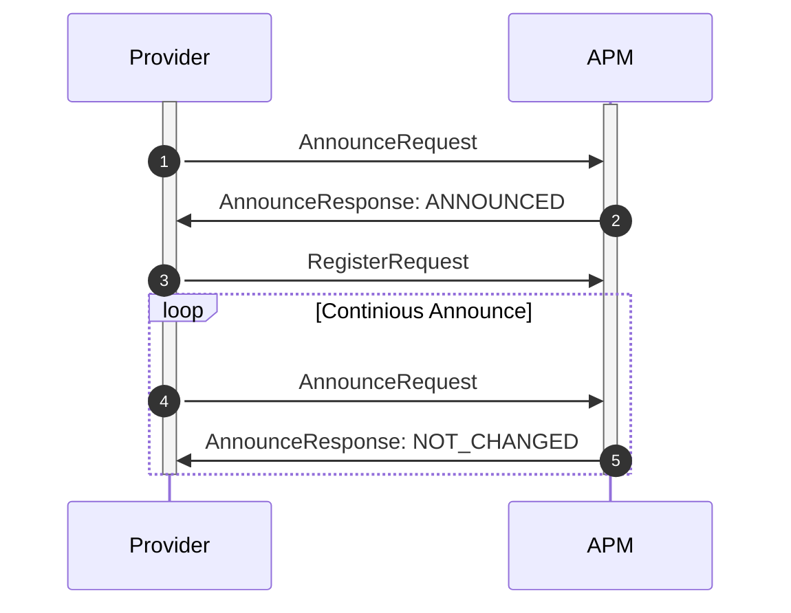

# Intent Registration

- Status: accepted
- Authors: Atif Aziz, Bastian Burger, Daniele Antonio Maggio,
  Dariusz Parys, Patrick Schuler
- Last updated: 2022-08-11

## Context and Problem Statement

Chariott provides an API for registration and discovery of capabilities
offered by services and needed by applications.

The scope of this ADR is to describe the interfaces for registration.

## Terms

- Application Programming Model (APM)
- APM Registry - Registry for all intent providers

## Requirements

1. Register intent providers with the APM to support redirecting of application
   requests to the correct implementation
2. Registrations need to support namespaces to match intent requests
3. Registrations need to be resilient toward APM restarts as well as intent
   provider restarts
4. Independence of a control plane (it is not know at the time of this writing)

## Decision

Providers and the APM do run in different processes. Any of them are assumed to
be restarted at any time. To support a resilient system where the current state
is always represented in the APM Registry we are re-using the initial
implementation from CTP-1 with a continuous announcement request from the
providers to the APM Registry. The announcement request allows the system to
recover from registry restarts as well as provider restarts or removal.
Re-configurations are detected as well through the announcement message to allow
redirect of the endpoint after a restart of a provider.



The registration request supplies metadata for the provider service itself as
well as all supported intents for the provider. If a provider does support a
particular intent, it needs to handle intent requests to a defined proto API
coming from the APM.

```proto
syntax = "proto3";

package chariott.registration.v1;

service RegistrationService {
  rpc Announce(AnnounceRequest) returns (AnnounceResponse) {}
  rpc Register(RegisterRequest) {}
}

message Service {
  string name = 1;
  string version = 2;
  string url = 3;
}

message AnnounceRequest {
  Service service = 1;
}

message AnnounceResponse {
    RegistrationState registration_state = 1;
}

message RegisterRequest {
  Service service = 1;
  repeated IntentRegistration intents = 2;
}

message IntentRegistration {
  string namespace = 1;
  string intent = 2;
}

enum RegistrationState {
    ANNOUNCED = 0;
    NOT_CHANGED = 1;
}
```
