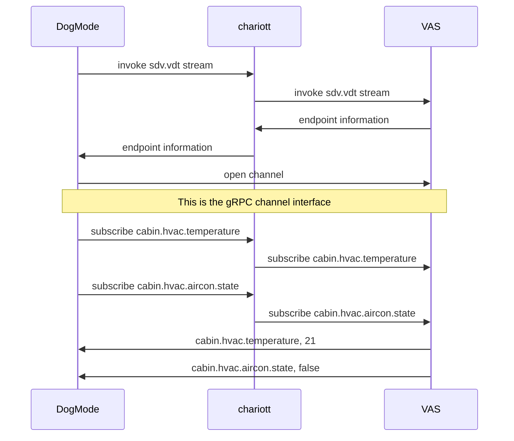
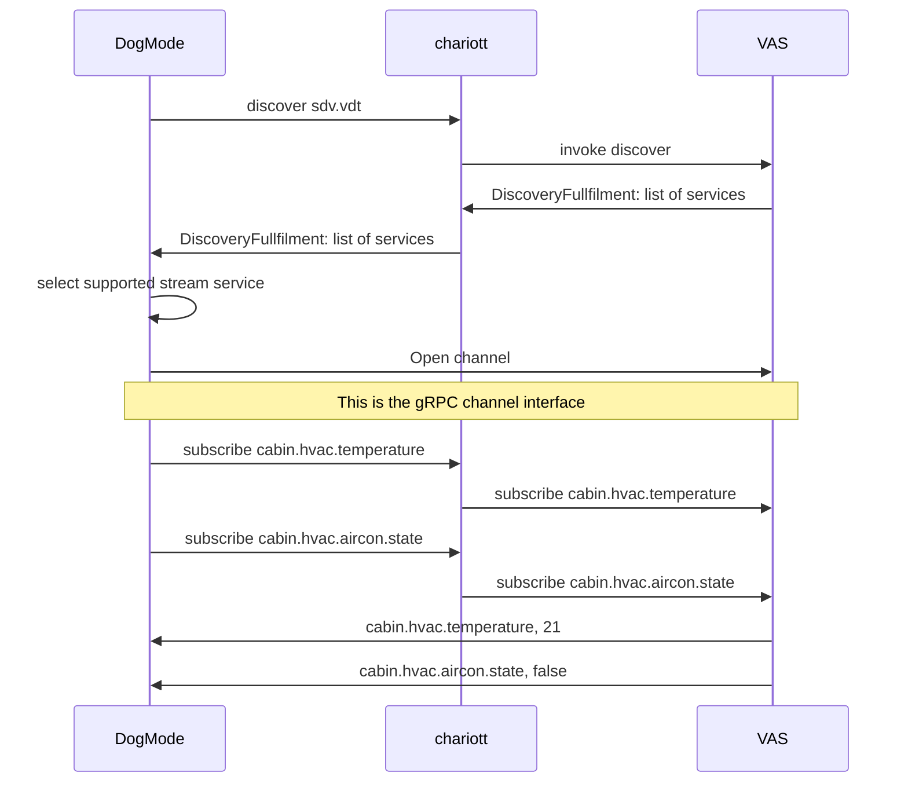

# Streaming Support

- Status: accepted
- Authors: Atif Aziz, Dariusz Parys, Patrick Schuler
- Last updated: 2022-08-18

## Context and Problem Statement

Applications need to stream various sources of data (Telemetry, Events, etc). The
chariott needs to support the ability to stream data from various providers to applications
interested in.

## Considered Options

The current state of thought is to directly stream data from the providers to the
application. The two considered option vary in the approach these endpoints are
exposed. Either we introduce a dedicated stream intent to the chariott or we re-use the
discovery mechanism which is capable of retrieving any kind of interfaces requested
by the applications. Both approaches are considered viable options.

## Not Considered Options

Opening the stream channel through the chariott runtime. We don't support this scenario in
the current iteration of this project.

### Stream Intent Alias

This is a simplification for application developers in order to retrieve a dedicated
url for stream events through a defined gRPC interface.



The native stream intent would expand the current chariott.common.v1.proto.

```proto
syntax = "proto3";

package chariott.common.v1;

import "google/protobuf/timestamp.proto";
import "google/protobuf/any.proto";

message Intent {
    oneof intent {
        DiscoverIntent discover = 1;
        InvokeIntent invoke = 2;
        StreamIntent stream = 3;
        SubscribeIntent subscribe = 4;
    }
}

message Fulfillment {
    oneof fulfillment {
        DiscoverFulfillment discover = 1;
        InvokeFulfillment invoke = 2;
        StreamFulfillment stream = 3;
        SubscribeFulfillment subscribe = 4;
    }
}

message StreamIntent {
    string namespace = 1;
}

message StreamFulfillment {
    string namespace = 1;
    string url = 2;
}

message SubscribeIntent {
    string channel_id = 1;
    string target = 2;
}
message SubscribeFulfillment {
    string subscription_id = 1;
}

// rest of proto omitted

```

Subscription will happen through the `Subscribe` intent on the `chariott.runtime.v1.proto`

### Streaming through the Discover Intent



```proto
syntax = "proto3";

package chariott.common.v1;

import "google/protobuf/timestamp.proto";
import "google/protobuf/any.proto";

message Intent {
    oneof intent {
        DiscoverIntent discover = 1;
        InvokeIntent invoke = 2;
        SubscribeIntent subscribe = 3;
    }
}

message Fulfillment {
    oneof fulfillment {
        DiscoverFulfillment discover = 1;
        InvokeFulfillment invoke = 2;
        SubscribeFulfillment subscribe = 3;
    }
}

message SubscribeIntent {
    string channel_id = 1;
    string target = 2;
}
message SubscribeFulfillment {
    string subscription_id = 1;
}

// rest of proto omitted

```

## Decision Outcome

Streaming through the Discover Intent

- no additional intent required
- discover intent is designed to be used to communicate directly with the provdiders

### Proto definition (if any)

The application and provider will agree on this proto definition in order to
open the channel through gRPC. The channel_id for the channel will be provided
by the metadata of the gRPC call.

```proto
syntax = "proto3";

package chariott.streaming.v1;

import "chariott.common.v1.proto";

service Channel {
    rpc Open (ChannelRequest) returns (stream ChannelResponse) {}
}

message ChannelRequest {}

message ChannelResponse {
    string source = 1;
    chariott.common.v1.Value value = 2;
    uint64 seq = 3;
    google.protobuf.Timestamp timestamp = 4;
}
```
