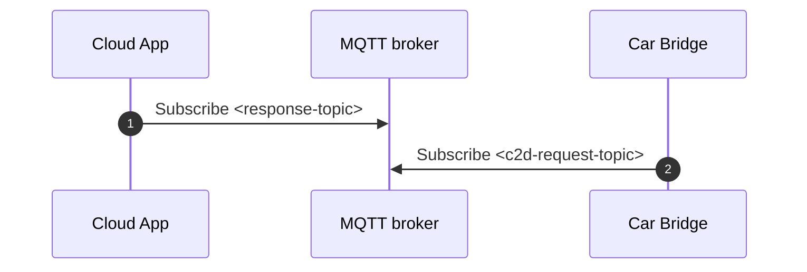
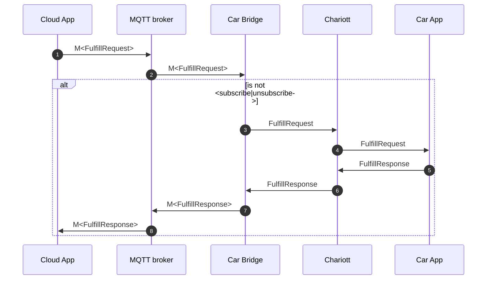
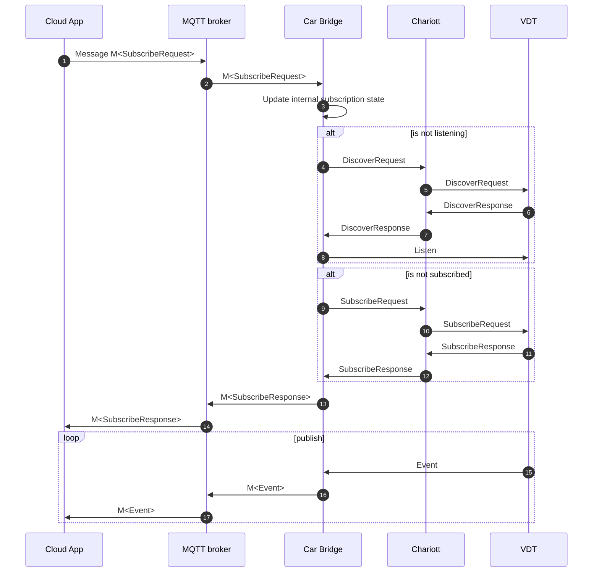
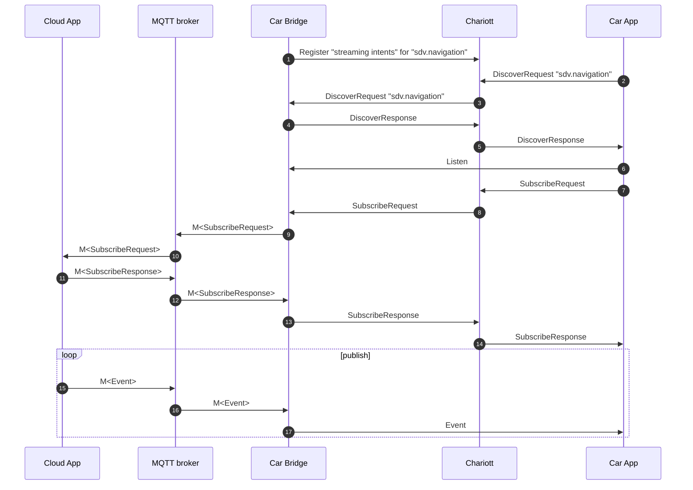

# Cloud integration

## Terminology

- C2D or cloud-to-device: The car fulfills a request originating from the cloud.
  This includes streaming data from the car to the cloud.
- D2C or device-to-cloud: The cloud fulfills a request originating from the car.
  This includes streaming data from the cloud to the car.

## Context and Problem Statement

Currently, Chariott supports offloading a (stateless) computation into the
cloud (see the [examples README]). Supporting a more complete integration from
Chariott with the cloud will enable more seamless communication between the
car and the cloud.

## Requirements

- Streaming data from the car to the cloud.
- Streaming data from the cloud to the car.
- Send `FulfillRequest` from the cloud to the car and responding to the cloud.
- Send `FulfillRequest` from the car to the cloud and responding from the cloud.
- Cloud applications need to be able to register with Chariott in the car.

## Out of scope

- Privacy and E2E encryption
- AuthN/Z
- Ergonomics around how to program applications in the cloud. They are
  expected to interface with the MQTT broker directly.
- Have a network-friendly API (less chatty) for Chariott
- Change the Chariott API to support more features around consistency (ETag)

### Handled in future ADRs

- Error model
- Pre-aggregation, downsampling and filtering of events inside the Car

## Decision

We will create an application, called _Car Bridge_, which integrates Chariott
with the cloud. The Car Bridge is deployed to the car and interacts with
Chariott like any other application. Chariott will not special-case the Car
Bridge.

The Car Bridge works in conjunction with an MQTT broker which is located in
the cloud. The Car Bridge consumes messages from a topic on the MQTT broker to
receive fulfillment requests (`chariott.runtime.v1.FulfillRequest`) that it
fulfills by interacting with Chariott on-behalf of cloud applications, by
using the identical API (`chariott.runtime.v1.proto`) as any other in-car
application.

The Car Bridge fulfills `FulfillRequest` originating from in-car applications
through cloud-based applications by going through the MQTT broker.

The following intents will not be exposed via the Car Bridge:

- `Discover`

### Protocol

We use MQTT 5 as a communication protocol between the cloud and the Car Bridge.
MQTT 5 [supports the Request/Response pattern][mqtt-req-rsp], which the
Car Bridge will use to respond to a `FulfillRequest` with a `FulfillResponse`.

The Car Bridge will send a `FulfillResponse` (unmodified) as a message, where
the payload is encoded in Protobuf, to the MQTT broker while also setting
appropriate properties. We will use the **[Correlation Data]** and **[Response
Topic]** properties to allow for request/response style communication.

For transmitting `FulfillRequest` messages between the cloud and the car, the
clients will use QoS 2, as we cannot assume that the execution of every
`FulfillRequest` is idempotent.

### C2D

The Car Bridge subscribes to a topic from the cloud-based MQTT broker.
Messages published on this topic represent an intent that the Car Bridge must
fulfill on-behalf of a cloud application. These C2D messages must contain
properties that allow usage of the [Request/Response pattern][mqtt-req-rsp].

If the Car Bridge receives a message, it parses the message and executes the
fulfillment request which is contained in the message. For all non-streaming
intents, this implies that the Car Bridge executes the unmodified
`FulfillRequest` against Chariott. The response (either success or error) is
sent to the MQTT broker. The detailed error model is out of scope for this ADR.

For handling intents related to streaming, the Car Bridge keeps internal state
and establishes the required channels with the target applications (if required)
to set up streaming. Events are published as messages to the MQTT broker. If
multiple cloud applications register for the same event, the Car Bridge keeps
track of the number of subscriptions to the same source for a given namespace
and takes care of managing the channels for these subscriptions.

The `SubscribeIntent` contains the channel ID, which in the car defines the
channel on which to publish events. For requests originating from the cloud,
the identifier specifies the topic on which to publish events. The channel ID
is reused as the identifier of the topic to which the Car Bridge will publish
the event.

Open questions:

- Do we need to add an MQTT broker on the edge as well to support offline
  scenarios? This would be to address the case where the car goes offline
  while trying to reply to C2D requests.

- Subscription expiration: what if a cloud app does not/forgets to
  unsubscribe? This is to prevent unnecessary resources being taken up, such
  as the channels the Car Bridge may have open.

### D2C

The Car Bridge must be able to register with Chariott on-behalf of cloud
applications. It will send announcements and registrations based on some
configuration, which is described in detail in the section about [on-behalf of
registration](#on-behalf-of-registration).

Chariott will not see the Car Bridge different from any other application.
That is, fulfillment requests are routed to the Car Bridge based on the same
mechanism as for any other application. An in-car application will not known
whether a Car Bridge is deployed, or whether an intent is fulfilled by the
cloud.

Both streaming and non-streaming requests from the car to the cloud are
handled in the same manner as the C2D flow. The Car Bridge will send an MQTT
message for the subscription to the cloud (assuming that a cloud application
is listening), which will then send events to the car for a given
subscription. The cloud application will send the events as messages to a
designated topic that the Car Bridge is subscribed to. The Car Bridge must be
resilient and unsubscribe from the cloud in case the in-car stream with the
application breaks.

Out of scope:

- Dynamically switching over from one stream to another (cloud to local). In
  other words, if the cloud is streaming to the in-car application and
  connectivity breaks then there is no seamless switch over to a local
  application offering the same capability.

Questions:

- We don't have a Protobuf message for unsubscribing so what will the Car
  Bridge sent as a mesasge to unsubscribe?

- How will the scale be handled? How many streaming end-points will the Car
  Bridge expose?

- If connectivity with the cloud is lost then how will the application know
  it's not going to get any more events?

- The Car Bridge will need to expose a new end-point for every namespace
  because intent fulfillment requests do not contain the namespace. Or
  should we extend the intent request to include the namespace?

#### On-behalf of registration

The Car Bridge must register cloud applications with Chariott to support
fulfilling requests coming from in-car applications. There will be a dedicated
MQTT message that the Car Bridge will support for updating registration
information. When the Car Bridge receives such a message, it updates its
internal state based on which cloud services are made available in the car.

If the list of available services/intents from the cloud changes, the Car Bridge
will re-register with Chariott. If nothing changes, it will continue to send
announcement messages to Chariott, just as every application must do when
integrating with Chariott.

In an initial version, the Car Bridge will not attempt to unregister
applications if connectivity is lost therefore cloud applications will appear
to be available at all times.

## Alternatives considered

### Using gRPC as a Car Bridge protocol

Since we already have the `chariott.runtime.v1.proto` API, we considered
exposing it directly as a gRPC API. This would make it more consistent to
interact with Chariott, whether it's a cloud-based or an in-car based
application. Using gRPC would simplify timeout handling for request/response
style services. Since gRPC is based on HTTP, this would imply that we forgo the
features that come with a protocol like MQTT for operating in an environment
with unstable connections. For D2C this would mean that we need a
Chariott-compatible endpoint in the cloud.

### DSL execution engine

To support communication from the car to the cloud and from the cloud to the
car, we considered building a DSL that can be deployed in a lightweight manner
to the car. The DSL supports syntax to allow accessing Chariott as well as cloud
messaging. This enables custom scripts to set up subscriptions, invocations or
any other intent fulfillments while also enabling complex business logic to be
evaluated in the car (e.g. throttling, conditions, etc.).

### AMQP

AMQP is another protocol frequently used for IoT messaging, which is heavier
compared to MQTT. Since both protocols are common and support the features that
we need, we go with MQTT.

### Cloud-driven periodic registration

We considered letting the applications from the cloud send a periodic message to
the Car Bridge for registration to Chariott, while also specifying when to
expect the next announcement. While this improves scenarios where connectivity
is temporary lost (as Chariott will evict the service if it does not receive an
announcement message for a sufficiently long time), there is always the
possibility that connection is lost between the last announcement and the next
announement. We will consider this as an optimization in the future.

## Appendix

A collection of flows that illustrate how Chariott can be integrated for
cloud-based applications. We will denote MQTT messages as `M<T>`, and gRPC calls
without the `M`-prefix.

### Initialization

There are steps common to multiple flows that we refer to as "initialization".
Other flows are based on these initialization steps, we will not repeat the
initialization steps over and over in the following diagrams.

1. Cloud App listens for messages on `<response-topic>`. The topic will contain
   responses for messages that require a response. We use the [MQTT
   Request/Response][mqtt-req-rsp] pattern for correlating requests and
   responses.

2. The Car Bridge listens for messages coming from the cloud, using the
   `<c2d-request-topic>`.

### Request/Response

We support request-response-style communication from the cloud to the car. The
equivalent flow also applies for the direction car to cloud.

1. The Cloud App sends a message containing a `FulfillRequest` to the Cloud
   Bridge. The message contains all properties required for correlation.

2. The Car Bridge receives the `M<FulfillRequest>` on the `<c2d-request-topic>`
   topic and extracts the inner `FulfillRequest`. If the payload is related to
   streaming, it will take the flow as described in [events from the car to the
   cloud](#events-from-the-car-to-the-cloud).

3. - 6. The Request is forwarded to Chariott and Chariott handles it as it would
        any other in-car `FulfillRequest`.

7. The Car Bridge sends the `FulfillResponse` message on the indicated response
   topic to the MQTT broker (`<response-topic>`).

8. Since the Cloud App is subscribed to the reponse topic `<response-topic>`, it
   will receive the response for the `FulfillRequest`. It can be correlated to
   the request by using the correlation identifier.

### Events from the car to the cloud

Cloud applications can subscribe to events from the car. This allows
transferring telemetry, e.g. from the VDT or a custom application, into the
cloud.

1. A cloud application sends a `subscribe` intent inside a message
   (`M<SubscribeRequest>`) on the `<c2d-request-topic>` topic.

2. The Car Bridge receives the `M<SubscribeRequest>` as it is subscribed to the
   `<c2d-request-topic>` topic.

3. The Car Bridge must maintain the state of the subscriptions. If multiple
   cloud applications requested the same events, the Car Bridge must subscribe
   to the data in the car exactly once. If some applications unsubscribe, it
   must stay subscribed to the data as long as at least one cloud application
   requires the data.

4. - 8. If the requested subscription is the first subscription to a certain
        namespace, the Car Bridge will need to establish a channel to receive
        the data from the source.

9. - 12. If the Car Bridge is not yet subscribed to the data, it must ensure
         that it subscribes to the specified keys on the source.

10. The Car Bridge delivers the `SubscribeResponse` as `M<SubscribeResponse>` to
    the MQTT broker.

11. The Cloud App receives the `M<SubscribeResponse>` from the MQTT broker.

12. The VDT publishes an `Event`, to which the Car Bridge is subscribed to.

13. The Car Bridge wraps the `Event` in a `M<Event>` and sends it to the MQTT
    Broker.

14. The Cloud App receives the `M<Event>` from the MQTT broker.

### Cloud-to-device (C2D) events

1. The Car Bridge (or another "on-behalf-of" application) registers the
   "streaming intents" (`Discover`, `Subscribe`, `Unsubscribe`) to Chariott for
   a given namespace, in this case `sdv.navigation`.

2. - 6. The Car App listens to events for namespace `sdv.navigation` (which
        points to the Car Bridge).

7. The Car App issues a `SubscribeRequest` to Chariott.

8. Chariott routes the `SubscribeRequest` to the Car Bridge.

9. - 14. The Car Bridge forwards the `SubscribeRequest` to the cloud, similar
         to what is described for [Request/Response](#requestresponse)
         communication. The response from the cloud is returned as a response to
         the Car App.

10. The Cloud App publishes a `M<Event>` to the MQTT broker.

11. The Car Bridge receives the `M<Event>` from the MQTT broker.

12. The Car App is subscribed to the Car Bridge and hence receives the `Event`.

[mqtt-req-rsp]: https://docs.oasis-open.org/mqtt/mqtt/v5.0/os/mqtt-v5.0-os.html#_Toc3901252
[Correlation Data]: https://docs.oasis-open.org/mqtt/mqtt/v5.0/os/mqtt-v5.0-os.html#_Correlation_Data
[Response Topic]: https://docs.oasis-open.org/mqtt/mqtt/v5.0/os/mqtt-v5.0-os.html#_Response_Topic
[examples README]: ../../examples/applications/README.md
