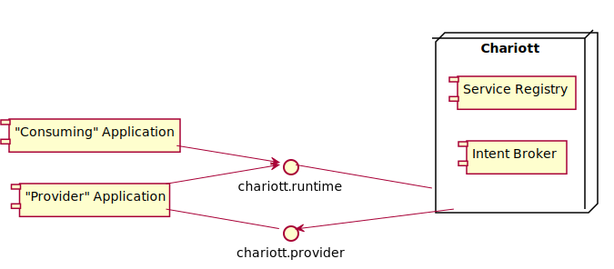
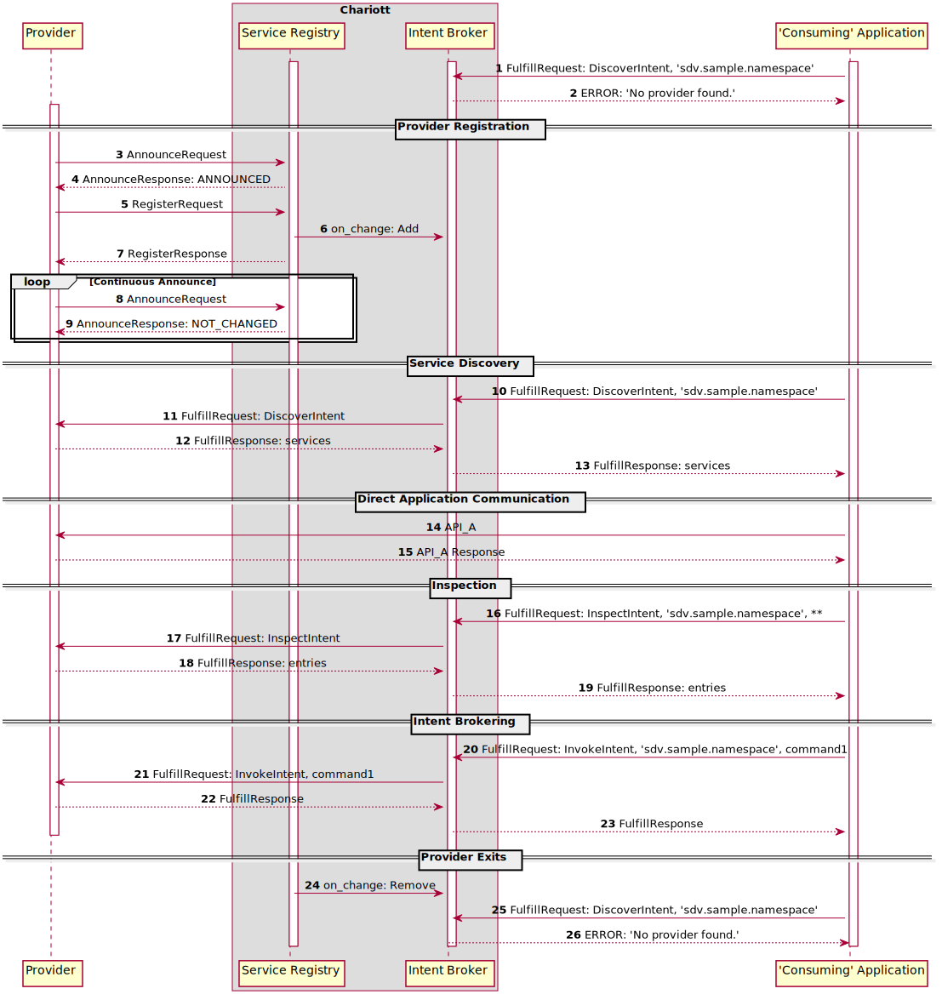

# Design Specification for Project Eclipse Chariott Intent Brokering

- [Introduction](#introduction)
- [Architecture](#architecture)
- [Intent Brokering Sequence Diagram](#intent-brokering-sequence-diagram)

## <a name="introduction">Introduction</a>

Project Eclipse Chariott delivers a metadata-driven application programming model. Today, the Intent Brokering service serves two main purposes. First, it offers service discovery of "provider" applications advertising their functionality. These providers register their capabilities with the Intent Broker. Second, the Intent Broker provides the brokering of intent requests from any application towards the offering providers. This was founded on [Capability Oriented Architecture](https://www.linkedin.com/pulse/brief-introduction-capability-oriented-architecture-coa-haishi-bai/) (COA). Since the service provides a common [gRPC](https://grpc.io/) interface for interacting with applications, it can be used with any language supporting gRPC. For more details on the gRPC interfaces, please see the [proto folder](../../intent_brokering/proto/).

## <a name="architecture">Architecture</a>

The Intent Brokering service itself has two main architectural components.

- Service Registry
- Intent Broker

The service registry is used for service discovery. It maintains a mapping of namespace to a list of services that are currently registered with that namespace and the metadata needed to communicate with that service.

The Intent Broker maintains a mapping of namespace and intent with the connection for the provider that can fulfill that intent request. It is used for brokering of intents.

Applications which interact with the Intent Brokering Service represent two additional architectural concepts.

- Applications -- represent any software component
- Intent Providers -- represent a software component which registers itself and its capabilities with the Intent Brokering service

The phrase "consuming application" can be used to describe an application which uses the Intent Brokering service to interact with another application, either through service discovery or intent brokering. It is important to note that any software component can use the service registry or intent broker to interact with another software component, including providers. In other words, an application can be both a provider and a "consuming application".

Below is the component diagram.

## <a name="sequence">Intent Brokering Sequence Diagram</a>

**Note:** Communication into and out of Intent Brokering goes through the Intent Brokering Server, a gRPC interface. Here, that is represented by the grey box.

1. Consuming application sends a Fulfill request to Discover the ‘sdv.sample.namespace’
2. No provider has been registered for ‘sdv.sample.namepsace’ so the service returns an Error saying no provider found.
3. The AnnounceRequest is sent to the Intent Broker. This step is optional, but it will tell the provider if they have already been registered.
4. A result of “ANNOUNCED” means that a provider with this namespace is not currently in the registry.
5. A RegisterRequest adds the provider to the Intent registry. It sends its service information and the intents it can fulfill.
6. When this change is triggered, on_change will get called to add the intent bindings for this provider to the Intent Broker.
7. A RegisterResponse is sent back to the provider
8. Provider starts a loop of AnnounceRequests so it does not get pruned
9. As long as the AnnounceResponse is NOT_CHANGED, the provider is still present in the registry. If at any point it receives an “ANNOUNCED” response, it should re-register itself with the Intent registry.
10. Consuming application sends a Fulfill request to Discover the ‘sdv.sample.namespace’
11. Intent Broker sends a Fulfill request to its intent binding for ‘sdv.sample.namespace’ Discover
12. Consuming application returns a fulfillment response with a list of services for that namespace including the url, protocol, and schemaReference file (i.e. proto file name) for how to directly communicate with the provider
13. The Intent Broker returns this fulfillment response to the consuming application
14. Consuming application directly calls API_A on the provider (which it found in the schema file). This is an example of direct application communication after using the service for Service Discovery.
15. Provider sends its response to the consuming application directly for API_A
16. Consuming application sends a Fulfill request to Inspect information about ‘sdv.sample.namespace’
17. Intent Broker sends a Fulfill request to its intent binding for ‘sdv.sample.namespace’ Inspect
18. Provider sends a FulfillResponse with the properties of the provider.
19. The Intent Broker returns this fulfillment response to the consuming application
20. Consuming application sends a Fulfill Request to Invoke command1 on the ‘sdv.sample.namespace’
21. Intent Broker sends a Fulfill request to its intent binding for ‘sdv.sample.namespace’
22. Provider sends a FulfillResponse
23. The Intent Broker returns this fulfillment response to the consuming application
24. At this point, the provider exits. When this happens, it will no longer be pushing its continuous announce heartbeat to the Intent Brokering service. After a configured amount of time, the service will be pruned from the registry and on_change will get called to remove the intent bindings for this provider to the Intent Broker.
25. Consuming application sends a Fulfill request to Discover the ‘sdv.sample.namespace’
26. Since the provider has been removed from the registry, it will return an Error saying no provider found.
