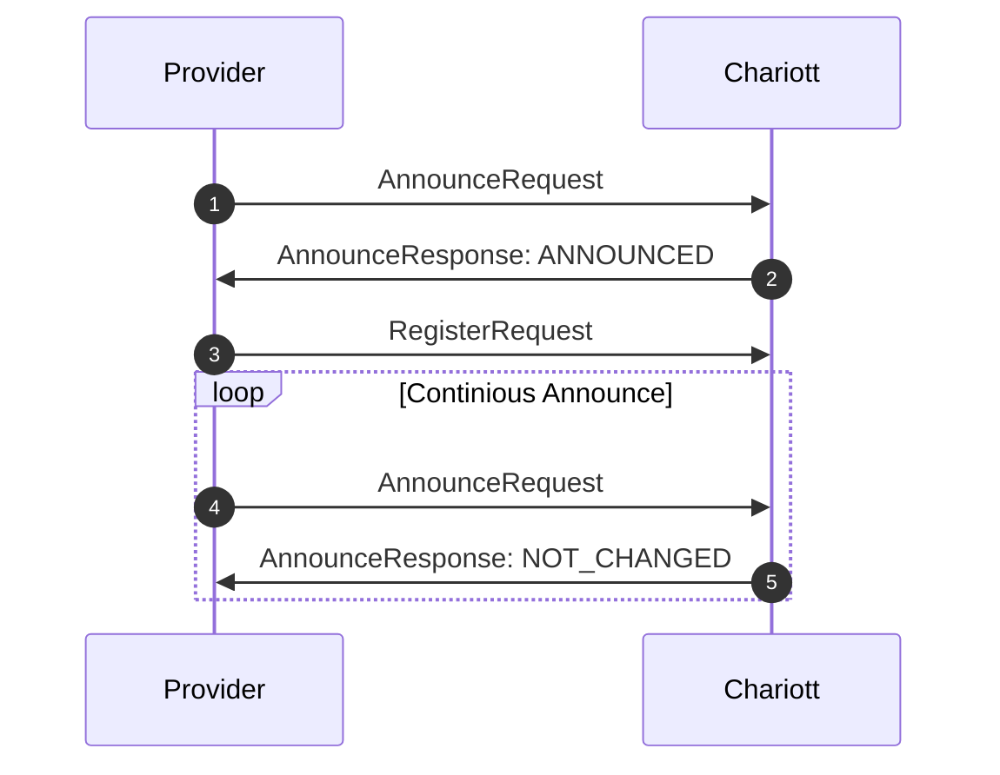
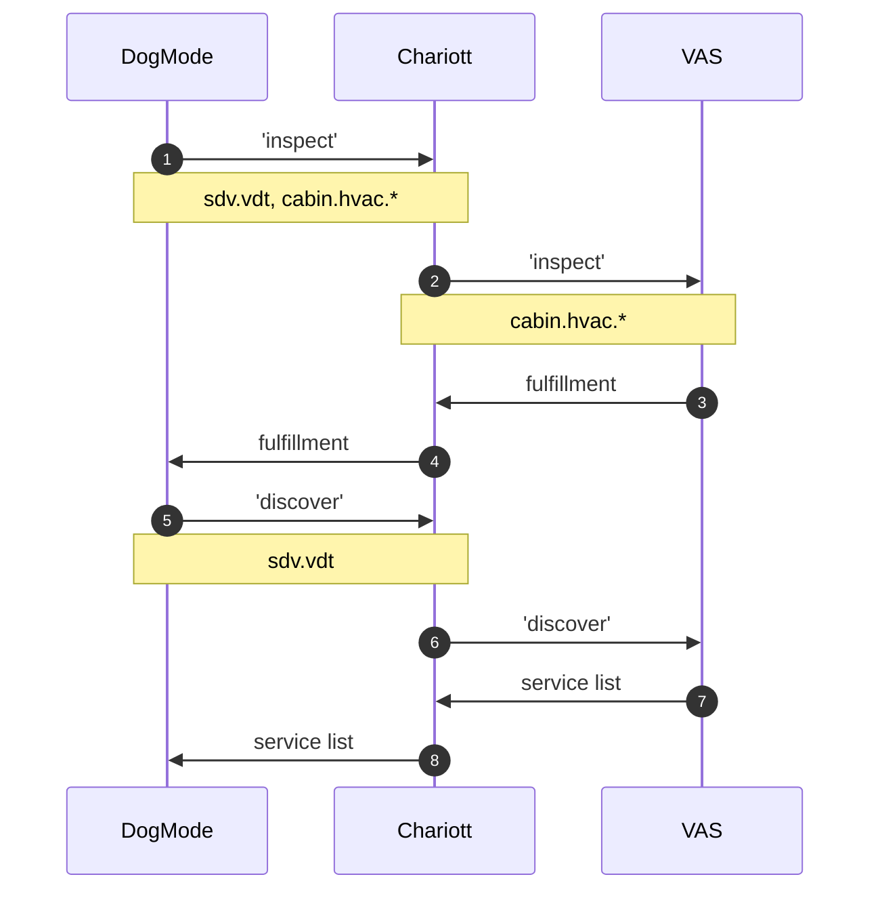
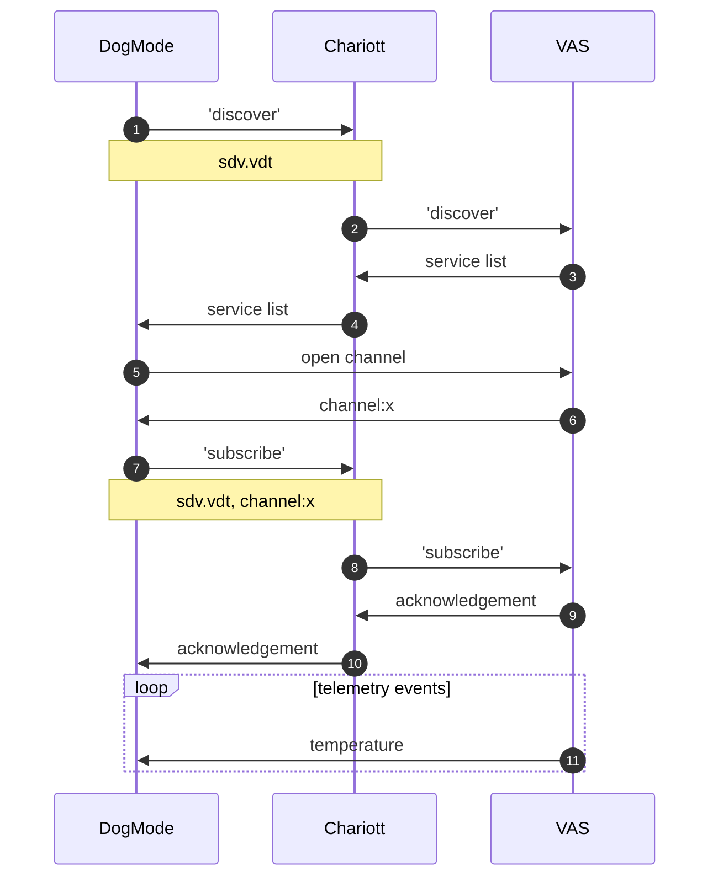
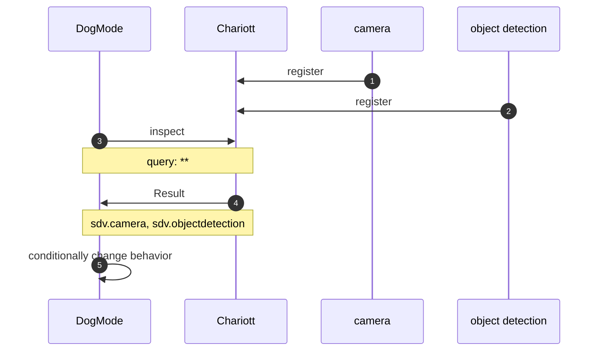
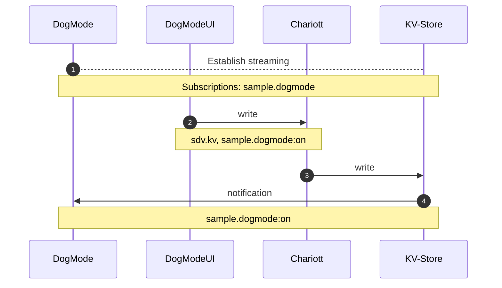
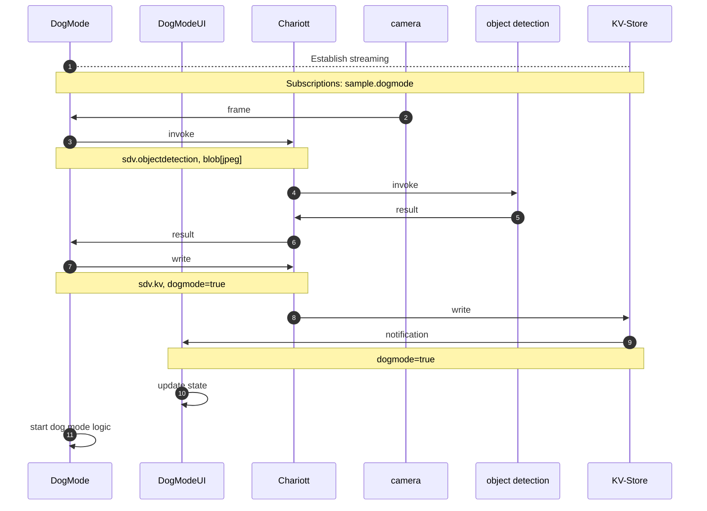
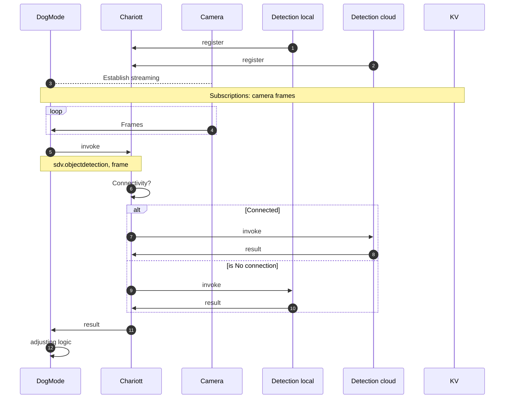

# Example applications

This directory contains a number of examples showcasing Chariott. The example
applications are not intended for production use, but illustrate how to approach
solving certain problems when interacting with Chariott. All example binaries
contribute to a demo scenario that we call _dog mode_.

## Dog mode

The dog mode allows a car owner to keep their dog safe while they are away from
the car. If the ambient temperature is high, different applications will
interact with each other to ensure that the temperature inside the car is at a
safe level for the dog. This works as follows: first, the dog mode logic
application (`intent_brokering/examples/applications/dog-mode-logic`) detects whether a dog is
present, either by automatically connecting a [camera][simulated camera] with
[object detection][local object detection], or through user interaction in the
[UI application][ui]. If a dog is detected, it will monitor various vehicle
hardware properties through the [mocked Vehicle Abstraction Service (VAS)][vas].
Based on certain conditions, actions are taken. For example, if the battery is
low, the owner is notified to return to the car immediately. If the temperature
rises, the air conditioning is turned on.

## Setup

You will need the .NET SDK and ASP.NET Core Runtime version 6. As of the writing of this,
installing the .NET SDK on Ubuntu installs the SDK, runtime, and ASP.NET Core runtime.

If you do not have these already, follow the instructions
[here](https://learn.microsoft.com/en-us/dotnet/core/install/linux-ubuntu-2004#add-the-microsoft-package-repository),
but replace the current version of the SDK with version 6 (dotnet-sdk-6.0).

Once the update is done, run:

```bash
dotnet --info
```

to ensure the installation was successful. At the end of the output message, you should see
something like the following. Ensure that they are major version 6, and that you have both the
SDK and ASP.NET Core runtime.

```bash
.NET SDKs installed:
  6.0.412 [/usr/share/dotnet/sdk]

.NET runtimes installed:
  Microsoft.AspNetCore.App 6.0.20 [/usr/share/dotnet/shared/Microsoft.AspNetCore.App]
  Microsoft.NETCore.App 6.0.20 [/usr/share/dotnet/shared/Microsoft.NETCore.App]
```

### Automatic dog mode

You can follow a simulation of this scenario by executing

```bash
./intent_brokering/examples/applications/run_demo.sh --cognitive_endpoint "<placeholder>" --cognitive_key "<placeholder>"
```

from the repository root directory.

> Note: The arguments for [Cognitive Services][cognitive services] can be left
> out and/or do not need to be valid to run the demo script. If erroneous
> arguments are detected, a [non-cloud based application][local object
> detection] is used for object detection.

The script will run the following components:

1. Chariott runtime from `src/`
2. [Mock VAS (including simulated vehicle state changes)][vas]
3. [Key-Value Store][kv app]
4. [Simulated Camera Application][simulated camera]
5. [Local Object Detection Application][local object detection]
6. [Cloud Object Detection Application][cloud object detection]
7. Dog Mode Logic Application from `examples/appliations/dog-mode-logic`
8. [Dog Mode UI Application][ui]

Once you have run the script, you can inspect the application logs that are written to
`target/logs`. This is helpful for troubleshooting if you experience unexpected behavior.

After the UI is being served, you can access it under <http://localhost:5079/>.
By default, the UI will also display the stream from the camera used to detect
whether a dog is present. You can access the camera stream at
<http://localhost:5079/streaming.html>.

Note that the dog symbol in the UI will turn green once a dog is detected. This
happens without much delay if you configured [Azure Cognitive Services
correctly][cloud object detection], but it will take longer if the logic uses
the fallback local object detection.

The simulation will oscillate the temperature between a lower and upper bound.
If the temperature is above a threshold and a dog is detected, you can see the
air conditioning being turned on. If the temperature falls, or the dog has left
the car, the air conditioning will be turned off.

### Manual dog mode

While the abovementioned flow runs continuously when you use the `run_demo.sh`
script, you can have more control over the applications by running (a subset of)
the components manually. Note the following behavior:

- If the camera app is not running, you can turn the dog mode on or off via the
  button in the UI.
- The mock VAS, which is responsible for simulating the car hardware, can be
  driven via standard input to make changes to the cabin temperature, battery
  level, etc.
- If you do not start, or misconfigure, the cloud object detection application,
  Chariott will automatically broker detection requests to the local detection
  application.

Refer to the documentation of each application to learn more about how to use
it.

[local object detection]: ./local-object-detection/README.md
[cloud object detection]: ./cloud-object-detection/README.md
[simulated camera]: ./simulated-camera/README.md
[ui]: ./dog-mode-ui/README.md
[vas]: ./mock-vas/README.md
[cognitive services]: https://docs.microsoft.com/en-us/azure/cognitive-services/what-are-cognitive-services
[kv app]: ./kv-app/README.md

## Flows

### Provider registration

To register a provider with Chariott, the provider needs to implement the
`chariott.provider.v1` protobuf interface. In addition it needs to register
itself using the `Announce` and `Register` method of the `chariott.runtime.v1`

This diagram shows the interaction between the provider and Chariott during
the registration process:



1. Provider starts up and announces itself to Chariott.
2. Chariott responds with `ANNOUNCED`.
3. Provider sends a `RegisterRequest` with all service details.
4. Provider continously sends an announce heartbeat to Chariott. If Chariott
   crashed between two announcements, it will respond with `ANNOUNCED`, in which
   case the provider should reregister using the `RegisterRequest`.

See the [Simple Provider Application][simple-provider] for a self-contained example for how to implement the above pattern.

[simple-provider]: ./simple-provider/README.md

### Vehicle integration

This scenario illustrates how you can integrate the vehicle hardware when using
Chariott. We inspect the Vehicle Digital Twin for the presence of a property and
discover how to connect to it directly.

Depends on: [provider registration](#provider-registration).

#### Participants

- DML - Dog mode logic application
- VAS - Vehicle abstraction service
- Chariott - Application programming model



1. `Inspect` is sent to Chariott to the `sdv.vdt` namespace with a query for
   `cabin.hvac.*`.
2. The `inspect` is forwarded the VAS that has registered for the `sdv.vdt`
   namespace.
3. The fulfillment is routed through Chariott.
4. Chariott routes the fulfillment back to the application - the result is used
   to make decisions about hardware availability and functionality that can be
   enabled in the application.
5. The application sends a `discover` intent to the `sdv.vdt` namespace to find
   an endpoint to communicate with the provider directly.
6. Chariott forwards the `discover` intent to the VAS.
7. The VAS generates the `discover` response containing information about
   endpoints that are exposed for direct consumption and returns it to Chariott.
8. Chariott returns the list to the application - the application then uses the
   information to connect directly to the intent provider.

### Streaming

We establish a stream that contains property changes from the Vehicle Digital
Twin. This pattern can be used to connect to any streaming provider.

Depends on: [provider registration](#provider-registration), [vehicle
integration](#vehicle-integration).



1. The application sends a `discover` request to Chariott for the `sdv.vdt`
   namespace.
2. Chariott forwards the request to VAS, which was registered for the namespace.
3. VAS generates a service list including the streaming endpoint for event
   notifications.
4. The service list is returned to the application.
5. The application uses the information from the service list to connect
   directly to the streaming endpoint and open a gRPC streaming channel.
6. The endpoint responds with a channel id.
7. The application sends a `subscribe` intent to the `sdv.vdt` namespace
   including the channel id that was established.
8. The `subscription` request is forwarded to the VAS including the target
   channel id.
9. An acknowledgement is returned to Chariott.
10. An acknowledgement is returned to the application.
11. The application receives update events for the subscribed telemetry.

### System Inspect

We inspect the Chariott registry to gather insights about the currently
supported intents and namespaces. This can be used to dynamically take
decisions, based on functionality currently present in the car.

Depends on: [provider registration](#provider-registration).



1. The camera application registers with Chariott.
2. The object detection application registers with Chariott.
3. The application sends an `inspect` intent to Chariott for the
   `system.registry` namespace.
4. Chariott sends registration information back to the application.
5. Application conditionally adapts its functionality based on availability of
   certain features.

### App-to-App communication

We communicate from the Dog Mode UI to the Dog Mode Logic Application through
Chariott and a provider application. The UI will write state updates, for which
the Dog Mode will be notified via a stream of value changes.

Depends on: [provider registration](#provider-registration),
[streaming](#streaming).



1. DogMode [establishes streaming](#streaming) for the key `sample.dogmode` with
   the KV-Store.
2. The DogMode UI is sending a `write` intent to Chariott for the
   `sample.dogmode` key in the `sdv.kv` namespace.
3. Chariott forwards the request to the KV-Store.
4. The KV-Store updates the value and checks its subscriptions. When it finds a
   matching subscription, a notification is sent to the target channel.

### Automatic dog detection

We show how to combine the abovementioned patterns to combine a stream of images
to detect whether a dog is present in the car or not. Based on the presence or
absence of a dog, we change state in the Key-Value store, which can be observed
by any application that needs to take action based on the current state.

Depends on: [provider registration](#provider-registration),
[streaming](#streaming), [app-to-app communication](#app-to-app-communication).



1. DogMode [establishes streaming](#streaming) for frames from the camera.
2. The Camera is sending frames to a subscribed consumer (DogMode).
3. The DogMode is invoking the `detect` command in Chariott for the
   `sdv.objectdetection` namespace passing in the frame from the camera.
4. Chariott forwards the request to the matching provider.
5. The result is sent back to Chariott.
6. The result is sent to the application.
7. After detecting a dog in the car, the application issues a `write` intent to
   Chariott for the `sdv.kv` namespace to update `dogmode=true`.
8. Chariott forwards the request to the right provider.
9. If there was a subscription setup from the UI, the UI is notified about the
   change of the `dogmode` state.
10. The state is updated in the UI and rendered.
11. The dog mode logic is executed.

### Multi Provider

Based on the scenario for [automatic dog detection](#automatic-dog-detection),
we show how to use Chariott to dynamically switch over from a cloud-based
provider for object detection to a local provider for object detection.

Depends on: [provider registration](#provider-registration),
[streaming](#streaming), [app-to-app communication](#app-to-app-communication),
[automatic dog detection](#automatic-dog-detection).



1. The local detection provider registers with Chariott.
2. The cloud detection provider registers with Chariott.
3. DogMode [establishes streaming](#streaming) for frames from the camera.
4. The camera starts sending frames over the channel.
5. The DogMode is invoking the `detect` command in Chariott for the
   `sdv.objectdetection` namespace passing in the frame from the camera.
6. Chariott finds 2 matching provider, one for cloud. It validates
   connectivity/bandwidth.
7. In case of connectivity, the request is sent to the cloud.
8. The response from the cloud is sent back to Chariott.
9. Alternatively or for fallback, the local provider is invoked.
10. Local detection is performed and returned to Chariott.
11. Chariott returns a unified result from a single provider to the application.
12. Depending on the result, the execution is adjusted.
