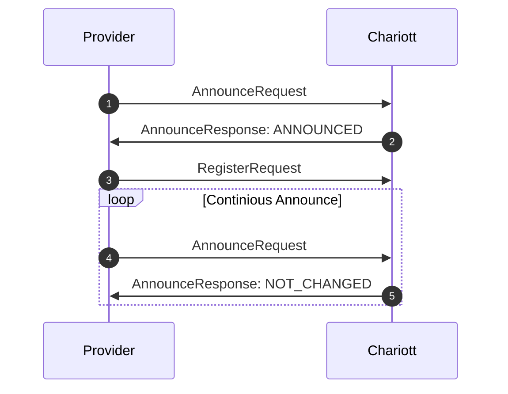

# Example applications

This directory contains a number of small examples showcasing Chariott Intent Brokering.
For more complex scenario examples, see the [Chariott Example Applications repository](https://github.com/eclipse-chariott/chariott-example-applications)

## Flows

### Provider registration

To register a provider with Chariott, the provider needs to implement the
`chariott.provider.v1` protobuf interface. In addition it needs to register
itself using the `Announce` and `Register` method of the `chariott.runtime.v1`

This diagram shows the interaction between the provider and Chariott during
the registration process:

1. Provider starts up and announces itself to Chariott.
2. Chariott responds with `ANNOUNCED`.
3. Provider sends a `RegisterRequest` with all service details.
4. Provider continously sends an announce heartbeat to Chariott. If Chariott
   crashed between two announcements, it will respond with `ANNOUNCED`, in which
   case the provider should reregister using the `RegisterRequest`.

See the [Simple Provider Application][simple-provider] for a self-contained example for how to implement the above pattern.

[simple-provider]: ./simple-provider/README.md
